<style>
.smallcaps { font-variant: small-caps; }
</style>

# Dokumentace k 2. projektu IPK – IPK25 Chat Client

**Autor:** Jan Kalina (`xkalinj00`)

**Předmět:** *IPK – Počítačové komunikace a sítě* <br>
**Akademický rok:** *2024/2025*

---

## Obsah

- [Obsah](#obsah)
- [1. Úvod](#1-úvod)
- [2. Teoretický základ a účel aplikace](#2-teoretický-základ-a-účel-aplikace)
  - [2.1 UDP varianta - datagramový protokol](#21-udp-varianta---datagramový-protokol)
  - [2.2 TCP varianta - textový protokol](#22-tcp-varianta---textový-protokol)
- [3. Sestavení a spuštění programu](#3-sestavení-a-spuštění-programu)
  - [3.1 Sestavení programu pomocí `Makefile`](#31-sestavení-programu-pomocí-makefile)
  - [3.2 Spuštění programu](#32-spuštění-programu)
- [4. Přehled architektury a struktura projektu](#4-přehled-architektury-a-struktura-projektu)
  - [4.1 Modul `Arguments`](#41-modul-arguments)
  - [4.2 Modul `Client`](#42-modul-client)
    - [4.2.1 Sumbodul `ClientFSM` – Specializované konečné automaty pro TCP a UDP variantu](#421-sumbodul-clientfsm--specializované-konečné-automaty-pro-tcp-a-udp-variantu)
    - [4.2.2 Submodul `ClientOutput` – Zpracování výstupu klienta](#422-submodul-clientoutput--zpracování-výstupu-klienta)
    - [4.2.3 Submodul `CommandParser` – Zpracování uživatelských příkazů](#423-submodul-commandparser--zpracování-uživatelských-příkazů)
  - [4.3 Modul `Common`](#43-modul-common)
  - [4.4 Modul `Exceptions`](#44-modul-exceptions)
  - [4.5 Modul `Facades`](#45-modul-facades)
  - [4.6 Modul `Messaging`](#46-modul-messaging)
    - [4.6.1 Submodul `MessageBuilder`](#461-submodul-messagebuilder)
    - [4.6.2 Submodul `MessageParser`](#462-submodul-messageparser)
    - [4.6.3 Submodul `MessagingHandler`](#463-submodul-messaginghandler)
  - [4.7 Modul `Networking`](#47-modul-networking)
    - [4.7.1 Submodul `TCPCommunicationHandler`](#471-submodul-tcpcommunicationhandler)
    - [4.7.2 Submodul `UDPCommunicationHandler`](#472-submodul-udpcommunicationhandler)
  - [4.8 Modul `App`](#48-modul-app)
- [5. Testování a verifikace funkčnosti](#5-testování-a-verifikace-funkčnosti)
  - [5.1 Interaktivní testovací konverzace mezi více instancemi klienta](#51-interaktivní-testovací-konverzace-mezi-více-instancemi-klienta)
    - [5.1.1 Testovací prostředí](#511-testovací-prostředí)
    - [5.1.2 Testovací scénář](#512-testovací-scénář)
  - [5.2 Testování pomocí testů od *Vlad6422*](#52-testování-pomocí-testů-od-vlad6422)
    - [5.2.1 Testovací prostředí](#521-testovací-prostředí)
    - [5.2.2 Testovací scénář](#522-testovací-scénář)
- [6. Závěr](#6-závěr)
- [7. Bibliografie](#7-bibliografie)
- [8. Přílohy](#8-přílohy)
  - [8.1 Adresářový strom projektu](#81-adresářový-strom-projektu)
  - [8.2 Výstup příkazu `make help`](#82-výstup-příkazu-make-help)
  - [8.3 Ukázka spuštění programu s parametrem `-h` pro výpis nápovědy](#83-ukázka-spuštění-programu-s-parametrem--h-pro-výpis-nápovědy)
  - [8.4 Ukázka použití příkazu `/help` pro zobrazení nápovědy v průběhu chatování](#84-ukázka-použití-příkazu-help-pro-zobrazení-nápovědy-v-průběhu-chatování)

## 1. Úvod

Tato dokumentace popisuje **IPK25 Chat Client**, aplikaci navrženou pro komunikaci se vzdáleným chat serverem pomocí protokolu **IPK25-CHAT**
Klient podporuje obě varianty transportní vrstvy – **TCP** i **UDP** (pouze **IPv4**) – a zajišťuje autentizaci uživatele, možnost změny kanálů 
v rámci daného serveru, odesílání a přijímání zpráv nebo dokonce změnu uživatelského (zobrazovaného) jména. V průběhu vývoje byla
zohledněna požadovaná funkcionalita vycházející z detailní specifikace a také odlišnosti jednotlivých variant transportních protokolů, 
jako je například potvrzování zpráv v **UDP** variantě, které je zu protokolu **TCP** zajištěno interně. Vedle odlišńostí transportních protokolů jsem dále
kladl velký důraz na návrh implementace zadaného Mealeho automatu, textové a bajtové formáty odesílaných a přijímaných zpráv, jejich 
efektivní validaci a reiterpretaci a řřadu dalších aspektů, které jsou popsány v následujících kapitolách.
Před samotnou implementací jsem navíc věnoval značné množství času objektovému návrhu a architektuře aplikace, abych mohl v na projekt daném časovém okně, 
co nejlépe dodržovat zásady *clean code* a *single responsibility principle*.

Z důvodu praktické a relativně nízkoúrovňové realizace využívá tento projekt jazyk **C++20** a je
strukturován do několika modulů a dílčích submodulů, které jsou uspořádány v různých adresářích (viz [adresářový strom projektu](#81-adresářový-strom-projektu).
Každý modul plní specifickou úlohu a dohromady vytvářejí architekturu, která dovoluje snadnou údržbu i rozšířitelnost.

Celý vývoj projektu jsem verzoval pomocí systému _Git_ na fakultním hostingu _Gitea_. Kompletní průběh
vývoje si můžete snadno prohlédnout přímo v [repozitáři projektu](https://git.fit.vutbr.cz/xkalinj00/IPK-Project-2-IPK25-Chat).
Pro lepší přehlednost jsem během práce důsledně používal *semantic commits*, což usnadňuje orientaci
v jednotlivých změnách a pomáhá rychle pochopit jejich význam.

---

## 2. Teoretický základ a účel aplikace

Jak jsem již zmiňoval v úvodu, aplikace **IPK25 Chat Client** realizuje speciální protokol *IPK25-CHAT* [[1]](https://git.fit.vutbr.cz/NESFIT/IPK-Projects/src/branch/master/Project_2#message-types), který definuje 
chování klienta a serveru v rámci chatovací služby pomocí konečného stavového automatu *Mealyho typu* [[2]](http://tcpipguide.com/free/t_TCPOperationalOverviewandtheTCPFiniteStateMachineF-2.htm). Konečný stavový automat Mealyho typu (dále jen **FSM**) 
provádí přechody na základě externích událostí, vstupů, na jejichž zákldě provádí jasně definované akce, přechody, mezi jednotlivými stavy. V rámci přechodu
může FSM provádět i další akec, jako například generování výstupních zpráv, které jsou zasílány uživateli – resp. může generovat výstupy. 
FSM Mealyho typu jsou proto vhodným nástrojem pro návrh a implementaci síťovvé komunikace.

Aplikace řídí celý životní cyklus komunikační relace – od navázání spojení přes autentizaci uživatele, přepínání mezi komunikačními kanály, odesíláním a příjmem zpráv
až po korektní ukončení spojení, tzv. *graceful termination*. Implementace protokolu je realizována ve dvou odlišných transportních variantách (**TCP** a **UDP**),
které se významně liší svým přístupem k zajištění spolehlivosti přenosu.

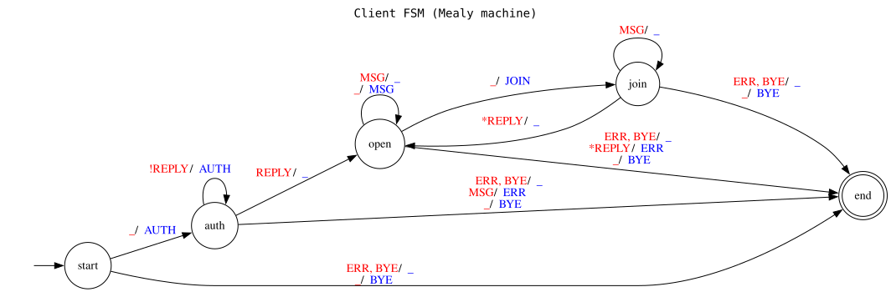

<span style="display: block; text-align: center;">*Obrázek 1: Konečný automat Mealyho typu uvedený v **zadání projektu** [[1]](https://git.fit.vutbr.cz/NESFIT/IPK-Projects/src/branch/master/Project_2#client-behaviour)*</span>

### 2.1 UDP varianta - datagramový protokol

*User Datagram Protocol* (**UDP**), transportní protokol definovaný v **RFC 768** [[3]](https://datatracker.ietf.org/doc/html/rfc768), je základní nespojovaný protokol transportní vrstvy, který poskytuje minimální služby pro přenos dat. 
Jeho hlavní charakteristikou je absence mechanismů pro zajištění spolehlivého přenosu, což znamená, že aplikace musí počítat s možností ztráty, duplikace či přeházení 
pořadí odeslaných paketů. Jak uvádí **RFC 5405 v sekci 3.1.1** [[4]](https://datatracker.ietf.org/doc/html/rfc5405#section-3.1.1), aplikace používající nespojovvý protokol 
**UDP** musí tolerovat ztrátu paketů, duplikaci a přeházené pořadí, což přesně odpovídá výzvám, se kterými jsem se potýkal při implementaci tohoto projektu.

V kontextu aplikace **IPK25 Chat Client** jsem musel implementovat vlastní mechanismy pro zajištění spolehlivosti, které nad základním **UDP** protokolem vytvářejí 
vrstvu poskytující funkcionalitu podobnou spojovaným protokolům (jako je **TCP**). Konkrétně jde o systém sekvenčního číslování zpráv, který umožňuje detekovat a řadit 
přijaté zprávy, mechanismus časových limitů a opakovaných přenosů pro případ ztráty datagramů, a také deduplikaci pro eliminaci duplicitně přijatých zpráv. Tyto mechanismy
jsou v souladu s doporučeními **RFC 5405** [[4]](https://datatracker.ietf.org/doc/html/rfc5405), které popisuje osvědčené postupy pro aplikace využívající UDP.

### 2.2 TCP varianta - textový protokol

*Transmission Control Protocol* (**TCP**), transportní protokol specifikovaný v **RFC 793** [[5]](https://datatracker.ietf.org/doc/html/rfc793), představuje robustní, 
spojově orientovaný protokol zajišťující spolehlivý přenos dat. Jak definuje **RFC 793 v sekci 1.5** [[5]](https://datatracker.ietf.org/doc/html/rfc793#section-1.5), protokol **TCP** 
poskytuje spolehlivý a zabezpečený přenos dat mezi dvojicemi procesů. 

Protokol **TCP** očekává, že z nižších vrstev komunikace může obdržet relativně nespolehlivé informace, 
proto bylo, dle mého názoru, mnohem pohodlnější zpracovávat **TCP** variantu projektu, protože veškeré nepříjemnosti spojené s používáním **UDP** protokolu, protokol **TCP**
řeší sám a aplikační vrstva se tak může soustředit na zpracování zpráv a jejich formátování namísto řízení a kontroly samotného přenosu dat – dle
**RFC 7414** [[6]](https://datatracker.ietf.org/doc/html/rfc7414), které mapuje vývoj **TCP** specifikací, protokol obsahuje pokročilé mechanismy pro řízení toku dat a předcházení 
zahlcení sítě, což přispívá k celkové robustnosti komunikace.

V rámci vývoje **TCP** varianty aplikace využívám textový formát zpráv s jasně definovanými oddělovači (přesně dle specifikace projektu), což umožňuje snadno zpracovat příchozí 
data a to dokonce i ve fragmentovaném stavu.

---

## 3. Sestavení a spuštění programu

### 3.1 Sestavení programu pomocí `Makefile`

Pro sestavení aplikace je k dispozici robustní `Makefile`, který nabízí celou řadu příkazů
usnadňujících práci s projektem. `Makefile` podporuje dva režimy: režim **pro odevzdání** a
režim **pro vývoj**, mezi kterými lze jednoduše přepínat pomocí příkazů `make developer-mode` a `make submission-mode`. 
Verze pro odevzdání je minimalistická a slouží primárně k sestavení finálního
binárního souboru aplikace. Naproti tomu režim pro vývoj obsahuje rozšířené funkce, jako jsou stavba
projektu pomocí CMake, zabalení projektu a kontrola základních požadavků na archiv a jeho obsah, instalace závislostí 
a další užitečné funkce usnadňující vývoj.

```bash
make && ./ipk25chat-client -h
```

`Makefile` zahrnuje základní příkazy jako:
- `make all` – sestaví finální aplikaci (binární soubor).
- `make build` – sestavení aplikace pomocí CMake ve verzi pro vývoj nebo pomocí Make ve verzi pro odevzdání.
- `make clean` – provede úklid generovaných souborů, rozdílný pro verzi vývojovou a odevzdávací.
- `make doc` – vygeneruje dokumentaci projektu pomocí nástroje Doxygen do `doc/documentation.html`.
- `make help` – zobrazí seznam a popis všech dostupných příkazů `Makefile`.
- `make pack` – vytvoří ZIP archiv se soubory určenými pro odevzdání (pouze ve verzi pro vývoj).

Detailní popis všech dostupných příkazů naleznete v automaticky generované nápovědě mého sebedokumentujícího `Makefile`,
kterou lze získat příkazem `make help` (viz příloha [8.2](#82-výstup-příkazu-make-help))

### 3.2 Spuštění programu

Program se spouští z příkazové řádky následujícím způsobem:

```bash
./ipk25chat-client [-h | --help] {-t udpOrTcp | --transport-protocol udpOrTcp} {-s ipOrHostname | --server ipOrHostname} [-p port | --port port] [-d timeout | --wait timeout] [-r max | --max-retransmissions max]
```

- `-h`, `--help`: Vypíše nápovědu a ukončí program s návratovým kódem 0.

- `-t`, `--transport-protocol`: Povinný parametr, který určuje použitý transportní protokol – buď hodnotu `tcp` pro spolehlivou, textovou komunikaci nad **TCP**, nebo `udp` pro odlehčenou variantu s potvrzováním na úrovni aplikace využívající stejnojmenný protokol **UDP**. Akceptovatelné jsou pouze řetězce "tcp" a "udp" (bez ohledu na velikost písmen).

- `-s`, `--server`: Povinný parametr, který určuje adresu chatovacího serveru, kterou lze zadat buď jako **IPv4** adresu nebo platný *hostname* (textovou adresu serveru). Klient na tuto adresu naváže spojení (**TCP**) nebo pošle své první datagramy (**UDP**).

- `-p`, `--port`: Volitelný parametr, který určuje číslo portu serveru v rozsahu $\left<1,\ 65535\right>$. Pokud je číslo portu blíže nespecifikováno, využije se výchozí hodnota `4567`.

- `-d`, `--wait`: Volitelný parametr určený pro variantu protokolu **UDP** (zadán u **TCP** bude ignorován). Časový limit v milisekundách, po jehož uplynutí klient považuje potvrzovací zprávu za ztracenou a pokouší se o opětovné odeslání (*retransmisi*). Musí se jednat o kladné celé číslo,implicitní nastavení je `250 ms`.

- `-r`, `--max-retransmissions`: Volitelný parametr určený pro variantu protokolu **UDP** (zadán u **TCP** bude ignorován). Tento parametr určuje maximální počet opakování odeslání (*retransmisí*) téže zprávy při, ke kterým dojde při neobdržení potvrzení přijetí této zprávy ze strany serveru. Hodnota musí být nezáporné celé číslo, výchozí hodnotou jsou 3 opakování.

Vedle základních krátkých forem parametrů je možné použít i jejich dlouhé varianty nad rámec zadání, které jsou popsány výše. Výpis programové nápovědy si můžete prohlédnout v příloze [8.3](#83-ukázka-spuštění-programu-s-parametrem--h-pro-výpis-nápovědy)

---

## 4. Přehled architektury a struktura projektu

Oproti prvnímu projektu do IPK, architektura tohoto projektu je mnohem větší. Celý projekt čístá dohromady přibližně 
100 zdrojových a hlavičkových souborů, což je důsledkem mého pokusu vytvořit kvalitní objektově orientovaná návrh. Zdrojový 
kód je organizován do několika složek reprezentujících moduly aplikace s jasně vymezenou odpovědností a případně
do dalších submodulů.

Architektura aplikace je postavena na principu vrstvení odpovědností, kde nejvyšší vrstva (`App`) využívá fasádu pro přístup k funkcionalitě, 
zatímco nižší vrstvy implementují konkrétní chování pro různé transportní protokoly. 

Snažil jsem se u každého instanciovatelného
modulu vytvořit společně veřejné **rozhraní** [[7]](https://moodle.vut.cz/pluginfile.php/1064523/mod_folder/content/0/03-05-IPP_OOJ-Krivka-2025.pdf) 
(*interface*), které definuje vnější chování daného modulu. Díky tomu mohou ostatní moduly,
které daný modul využívají, komunikovat s tímto modulem bez nutnosti znalosti jeho vnitřní implementace nebo toho, zda komunikuje
s varintou modulu určenou pro **TCP** nebo **UDP** – varianty modulů obou variant vystupují *na venek* stejným způsobem. 

Společné privátní rozhraní jsem se snažil definovat v bázových třídách, kterou jsou někdy, stejné jako všechna rozhraní, čistě virtuální, 
anebo dokonce samy implementují metody sdílené oběma variantami klienta (**TCP** i **UDP**). I tento krok zančně přispěl k lepší
modularizaci a deduplikaci kódu, což vede také k jeho lepší udržitelnosti. Bohužel se musím přiznat, že jsem nestihl dokončit úplně kompletní
refaktoring zdrojových souborů v tomto duchu – zejména jde o opakující se části kódu kontrolující návratové hodnoty síťových funckí. Přesto se
ale domnívám, že jsem zásady *clean code* [[8]](https://github.com/nesfit/ICS/blob/master/Lectures/Lecture_05/SOLIDni_kod.pdf) a
*single responsibility principle* [[9]](https://www.geeksforgeeks.org/single-responsibility-in-solid-design-principle/) dodržel v dostatečné 
míře, aby byl kód přehledný a snadno udržovatelný.

Níže je rychlý přehled jednotlivých modulů a submodulů a jejich účelu:

- `App`: **Hlavní vstupní bod aplikace (`main.cpp`).**
- `Arguments`: **Modul** zpracovávající parametry příkazové řádky a validuje vstupní argumenty.
  - `ArgumentParser`: Třída pro validaci a parsování argumentů příkazové řádky pomocí knihovny `CLI11` [[10]](https://cliutils.github.io/CLI11/book/).
  - `CLI11.hpp`: Knihovna třetí strany kompatibilní s mojí projektovou licencí poskytující příjemné rozhraní k parsování argumentů příkazové řádky.
- `Client`: **Modul** zapouzdřující hlavní logiku chatovacího klienta a implementaci stavového automatu.
  - `ClientFSM`: **Submodul** realizující konečný _Mealyho_ automatu definujícího stavy a přechody klienta.
  - `ClientOutput`: **Submodul** implementující formátovaný výstup do terminálu na zákaldě přijatých zpráv a jejich obsahu.
  - `CommandParser`: **Submodul** implementující logiku pro zpracování uživatelský příkazů a validaci jejich korektní struktury.
- `Common`: **Modul** definující sdílené datové třídy a datové typy používané napříč aplikací.
  - `ChatDataTypes`: Definice vlastních typů používaných v aplikaci, jako je společný variantní typ `MessageContent` pro **TPC** i **UDP**.
  - `CommandLineOptions`: Datová třída pro uchování zpracovaných argumentů příkazové řádky.
  - `ParsedMessage`: Datová třída pro uchování zpracovaných zpráv a jejich obsahu v podobě vektoru textových polí jejich parametrů.
  - `UserCommand`: Datová třída pro uchování uživatelských příkazů a jejich argumentů.
- `Constants`: **Modul** konstant různých účelů využívaných napříč programem.
  - `ClientInternalPhrases`: Textové konstanty dílčích frází, které jsou následně skládány do chybovvých zpráv vypsaných uživateli.
  - `ClientLimits`: Číselné konstanty omezující chování klienta (max. délka parametrů, povolené intervaly porty, apod.).
  - `ColorEscapeSequences`: Definice barevných sekvencí pro terminálové výstupy.
  - `DefaultCommandLineOptions`: Výchozí hodnoty pro argumenty příkazové řádky.
  - `ExceptionMessages`: Standardizované textové řetězce sloužící jako hlavní zprávy vlastních výjimek.
  - `MessageFields`: Definice počtu a indexů textových polí ve třídě `ParsedMessage` pro jednotlivé typy zpráv obou variant protokolu.
  - `MessageKeywords`: Klíčová slova obsažená ve zprávách protokolu **TCP** (např. *IS*, *OK*, *NOK*, ...)
  - `RandomNumberRanges`: Rozsahy náhodných čísel pro generování hodnot portů.
  - `RegexPatterns`: Regulární výrazy pro validaci vstupů, formátu zpráv a adres.
- `Enums`: **Modul** výčtových typů různých účelů využívaných napříč programem.
  - `Mapping`: **Submodul** využívající šablonové funkce k poskytnutí jednotného rozhraní pro mapování hodnot enumů na jejich textové reprezentace a naopak.
  - `ClientFSMStates`: Stavy konečného automatu klienta v rámci modulu `ClientFSM`.
  - `ClientInternalErrorMessages`: Výčtový typ vyjadřující výčet typů chybových hlášek klienta určených pro uživatele (v *mapperu* se mapují na konkatenaci dílčích frází).
  - `ExitCodes`: Standardizované návratové kódy aplikace pro různé typy chyb.
  - `MessageParameters`: Výčtový typ pro jednotlivé parametry zpráv protokolu **IPK25-CHAT**.
  - `MessageTypes`: Výčtový typ pro jednotlivé typy zpráv, která navíc mají `uint8_t` hodnoty jejich **UDP** *kódu*.
  - `TransportProtocolTypes`: Výčtový typ pro rozlišení **TCP** a **UDP** protokolu.
  - `UserCommandTypes`: Výčtový typ pro rozlišení jednotlivých uživatelských příkazů.
  - `ValidatorResults`: Výčtový typ pro výsledky validačních funkcí (v pořádku, nevalidní znaky, nutné zkrátit, ...).
- `Exceptions`: **Modul** definující hierarchii výjimek pro různé typy chybových stavů.
  - `ChatBaseException`: Bázová třída vvlastních výjimek definující jejich obsah – stručnou zprávu, detail, chybový kód a kód chybový hlášky pro uživatele.
  - `ChatExceptions`: Specializovvané třídy výjimek – `InternalErrorException`, `ConnectionErrorException`, `UserInteruptionException`, ...
- `Facades`: **Modul** fasád, které zapouzdřují komplexní interakce a poskytuje zjednodušené rozhraní.
  - `MainClientFacade`: Centrální komponenta řídící tok aplikace a propojující ostatní části.
- `Messaging`: **Modul** implementující zpracování, validaci a parsování zpráv protokolu.
  - `MessageBuilder`: **Submodul**, který staví požadované zprávy s danými parametry vv textovém formátu pro **TCP** a binárním pro **UDP** protokol.
  - `MessageParser`: **Submodul** sloužící pro převod textových/binárních dat na strukturované zprávy.
  - `MessagingHandler`: **Submodul** poskytující mezivrstvu mezi modulem `ClientFSM` a síťovým modulem `Networking`.
- `Networking`: **Modul** realizující síťovou komunikaci a abstrahuje rozdíly mezi protokoly.
  - `CommunicationHandlerBase`: Slouží zejména k zapouzdření společných třídních členů děděných do specializovaných variant.
  - `TCPCommunicationHandler`: Implementace spolehlivé komunikace pomocí TCP - využívá `connect()`, `send()` a `recv()`.
  - `UDPCommunicationHandler`: Implementace komunikace pomocí UDP včetně správy timeoutů, deduplikace a opakovaných přenosů - využívá `sendto()` a `recvfrom()` a dynamickou správu portů.
- `Utilities`: **Modul** poskytující doplňkové třídy obsahující pomocné metody využívané napříč celým projektem.
  - `CastUtils`: Šablonové funkce pro konverzi mezi různými typy dat (např. `uint8_t <-> EnumType`, `std::string <-> EnumType` a `size_t <-> IntegerType`, ...).
  - `CommunicationUtils`: Poskytuje metody pro rezoluci předané **IPv4** adresy nebo doménové adresy na jejich **IPv4** adresy.
  - `ExceptionHandler`: Centrální zpracování výjimek aplikace s volitelným výpisem chybových hlášekm mapováním na návratové kódy a ukončením aplikace.
  - `Logger`: Jednoduché logovací makro pro felxibilní logovací výpisy, ladění a trasování běhu dat v aplikaci (**nasdílel jsem ho *pull requestem* do zadání**).
  - `RandomNumberGenerator`: Generátor náhodných čísel pro generování náhodných hodnot portů (*nakonec nebyl zapotřebí, ale v řešení ho ponechám, když už jsem ho vytvořil :-)*).
  - `StringUtils`: Pomocné funkce pro práci s řetězci, escapování a formátování.
  - `SignalHandler`: Zpracování signálů operačního systému (`SIGINT`, `SIGSEGV`).
- `Validators`: **Modul** implementující validační logiku pro dílčí parametry zpráv a zpráv jako celku v parsované podobě.
  - `MessageParametersValidator`: Slouží k validaci jednotlivých parametrů zpráv a jejich obsahu, dlouhé parametry zkracuje.
  - `MessageValidator`: Kontroluje přesně danou strukturu polí třídy `ParsedMessage` a jejich obsah (specificky pro **TCP** a **UDP**).
- *A další dílčí soubory – rozhraní, bázové třídy, specializované třídy, ...* 

>Pro případné zájemce o implementační detaily doporučuji vygenerovat  **Doxygen** dokumentaci pomocí příkazu
>`make doc` a prozkoumat ji (bude umístěna v `doc/documentation.html`. Obsahuje podrobnosti o třídách, metodách 
>a jejich vzájemných vztazích.

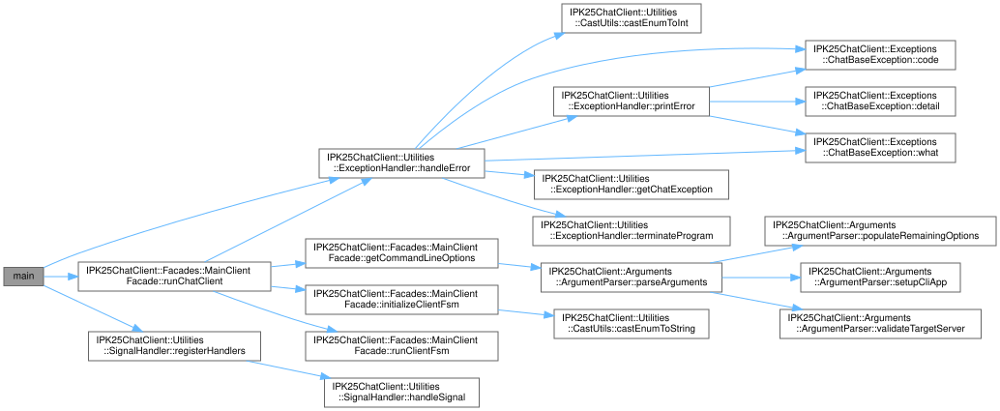

<span style="display: block; text-align: center;">*Obrázek 2: Graf volání z funkce `main()`*</span>


### 4.1 Modul `Arguments`

Parametry získané z příkazové řádky jsou uchovávány v instanci třídy `CommandLineOptions`.

Zpracování a validace vstupních argumentů probíhá prostřednictvím třídy `ArgumentParser`,
která využívá knihovnu **CLI11** [[10]](https://cliutils.github.io/CLI11/book/) pro parsování příkazové řádky.
Tuto knihovnu jsem zvolil pro její jednoduchost a přehledný manuál, díky kterému je možné rychle se s
knihovnou naučit pracovat. Současně je vedena pod **BSD licencí**, která je kompatibilní s **GNU GPLv3 licencí**
mé aplikace.

### 4.2 Modul `Client`

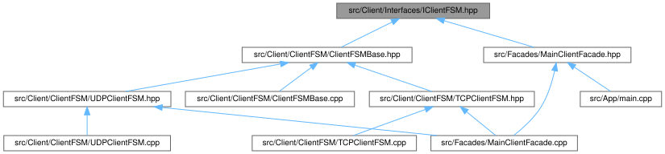

<span style="display: block; text-align: center;">*Obrázek 3: Závislosti konečného automatu (FSM)*</span>

#### 4.2.1 Sumbodul `ClientFSM` – Specializované konečné automaty pro TCP a UDP variantu

Jádrem celého modulu `Client` je implementace _FSM Mealyho typu_, který řídí chování klienta podle specifikace 
protokolu **IPK25-CHAT**. FSM definuje pět základních stavy: `START` (počáteční stav), `AUTH` (po odeslání autentizačních údajů), 
`JOIN` (žádost o připojení do jiného kanálu) a `OPEN` (stav, ve kterém klient přijímá zprávy) a END (ukončující stav 
sloužící k ukončení nekonečné běhové symčky FSM `while(true)`. Implementace obou verzí automatů závisejí na opakovaném
volání funkce `poll()`, která zajišťuje, že klient neustále čeká na události a reaguje na ně.

Implementace FSM se liší mezi **TCP** a **UDP** variantami zejména v oblasti zpracování přechodů mezi stavy. 
U **TCP** implementace je přechod stavů relativně přímočarý, protože protokol zajišťuje spolehlivé doručení zpráv ve správném pořadí. 
Naproti tomu **UDP** implementace musí řešit komplexnější scénáře, jako je retransmit odeslané `BYE` zprávy, opakování čekání 
na `CONFIRM` v modulu `Networking`, či řízení časovače čekání na očekávanou odpověď serveru `REPLY`. Stavový automat je navržen 
tak, aby v `UDP` variantě dokázal elegantně zpracovat potenciálně ztracené nebo zpožděné zprávy a udržet klienta v konzistentním stavu. 

Na rozdíl od **TCP** varianty je u varianty **UDP** implementován buffer uživatelských příkazů, jelikož je potřeba, aby FSM nejdříve
zpracovávalo příchozí zprávy, jejich potvrzeování a případné retransmity vlastních zpráv a až poté je možné provádět další uživatelské příkazy.
Pro jsem zavedl buffer těchto příkazů, aby uživatel mohl zadávat příkazy i v případě, že klient čeká na odpověď serveru.

<div style="display: flex; justify-content: center;">
    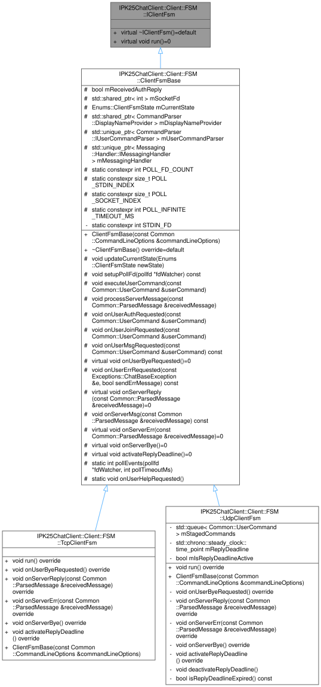
</div>
<span style="display: block; text-align: center;">*Obrázek 4: Dědičnost tříd implementující konečný automat (FSM)*</span>

#### 4.2.2 Submodul `ClientOutput` – Zpracování výstupu klienta

Submodul `ClientOutput` zajišťuje konzistentní a uživatelsky přívětivé zobrazování všech výstupů chatovacího klienta (dle zadání). 
Tato třída abstrahuje komplexitu formátování různých typů zpráv, jako jsou interní chyby klienta, chybová hlášení přijatá ze serveru, 
výpis nápovědy po zadání příkazu `/help` a přijaté zprávy od ostatních uživatelů či odpovědi serveru. Implementace používá různé

#### 4.2.3 Submodul `CommandParser` – Zpracování uživatelských příkazů

Třída `CommandParser` je zodpovědná za interpretaci uživatelských vstupů a jejich převod na interní příkazy. Implementace používá 
kombinaci regulárních výrazů (resp. validačních metod z modulu `Validators`) a stavového parsování pro identifikaci různých typů příkazů.
`CommandParser` nejen rozpoznává příkazy, ale také validuje jejich formát a parametry. Například kontroluje maximální délku zpráv, 
povolené znaky v uživatelském jménu a další omezení stanovená protokolem. Výstupem tohoto modulu je inicializovaná instance třídy 
`UserCommand`, která obsahuje typ příkazu a jeho parametry.

### 4.3 Modul `Common`

Tento modul obsahuje vedle jednoho variantního datového typu `MessageContent`, resp. `std::variant<std::string, std::vector<uint8_t>>` 
sloužícího k uchovávání textového obsahu zprávy pro **TCP** a binárního obsahu zprávy pro **UDP** již pouze datové třídy.
Níže uvádím jejich diagramy tříd, ze kterých dle mého názoru bude mnohem lépe vidět, k čemu slouží a z jakých členů se
skládají, než kdybych je popisoval slovy:

<div style="display: flex; justify-content: space-between; flex-wrap: nowrap; gap: 10px;">
    <div style="flex: 1; min-width: 0;">
        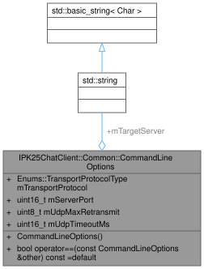
        <p style="text-align: center; margin-top: 5px;"><i>Obrázek 5: Třída <tt>CommandLineOptions</tt></i></p>
    </div>
    <div style="flex: 1; min-width: 0;">
        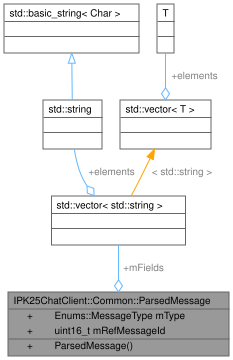
        <p style="text-align: center; margin-top: 5px;"><i>Obrázek 6: Třída <tt>ParsedMessage</tt></i></p>
    </div>
    <div style="flex: 1; min-width: 0;">
        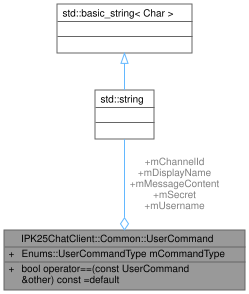
        <p style="text-align: center; margin-top: 5px;"><i>Obrázek 7: Třída <tt>UserCommand</tt></i></p>
    </div>
</div>

### 4.4 Modul `Exceptions`

Modul **Exceptions** poskytuje robustní mechanismus pro správu chybových stavů prostřednictvím výjimek.
Základním stavebním kamenem tohoto modulu je třída **ChatBaseException**, která dědí od standardní
třídy `std::exception`. Tato základní třída uchovává tři klíčové informace – chybový kód (reprezentovaný
pomocí hodnoty výčtové třídy `ExitCode`), obecnou chybovou hlášku, volitelně dodatečný detail popisující vzniklou chybu
a hodnotu výčtu `ClientInternalErrorMessages` rozhodující o tom, zda bude případně v rámci běhu FSM vytištěn do 
temrinálu chybovou hlášku pro uživatele.

Na základě **ChatBaseException** byly díky dědičnosti vytvořeny specializované třídy výjimek. Mezi ně patří
například **MessageLostErrorException** a **TimeoutErrorException**,
které se vyvolají v **UDP** v případech, kdy vyprší 5vteřinový časový limit na přijetí odpovědi `REPLY` od serveru 
nebo při vypršení počtu možných retransmitů potvrzovací zprávy `CONFIRM` (v tom případě je zpráva ztracena).
Dále modul obsahuje chybové výjimky jako **InvalidArgumentException**, **InternalErrorException** a další.

Chybové výjimky jsou zachytávány zejména v těle hlavní funkce FSM, kde se rozhoduje o tom, zda daná výjimka 
vyustí ve vypsání cyhbové zprávy pro uživatele, odeslání zprávy `ERR` nebo například, zda u UDP varianty dojde k 
odeslání zprávy `BYE` s maximálním počtem možných retransmitů. Dále jsou výjimky posílány dále, resp. do hlavní fasády 
uvnitř fasády `MainClientFacade`,kde je utility metoda `ExceptionHandler()` volány s příznakem pro ukončení programu (ve
většině případech s chybovým návratovým kódem dle typu chycené výjimky. Aplikace díky tomu obsahuje robustní a konzistentní 
správu chybových situací.

### 4.5 Modul `Facades`

`MainClientFacade` je hlavní fasádou aplikace [[11]](https://en.wikipedia.org/wiki/Facade_pattern). Je instanciována ve funkci `main()` a následně je pomocí jediného
příkazu `appFacade.runChatClient(argc, argv);` zahájen samotný běh aplikace. Jejím úkolem je:

- **zpracování příkazových argumentů** pomocí třídy `ArgumentParser`,
- inicializace instace třídy specializovaného `ClientFSM` pro daný transportní protokol dodržující veřejné rozhraní,
- spuštění běhu FSM pomocí volání jediné veřejné metody jejího rozhraní `mFsm->run();`,
- zachycení výjimek a jejich zpracování pomocí instance třídy `ExceptionHandler`.

### 4.6 Modul `Messaging`

#### 4.6.1 Submodul `MessageBuilder`

Submodul `MessageBuilder` se stará o sestavování zpráv ve formátu požadovaném zvoleným transportním protokolem. 
Pro **TCP** implementaci vytváří textové zprávy s definovanou strukturou (např. `MSG FROM username IS HelloWorld!`), 
zatímco pro **UDP** sestavuje binární zprávy s pevnou hlavičkou obsahující **1B** typ zprávy, **2B** identifikátor 
zprávy a následně data specifická pro daný typ zprávy. Tato binární struktura je efektivnější pro přenos, 
ale vyžaduje přesné dodržení specifikované struktury a korektní zarovnání všech bajtů. Zároveň je nutné, abych
při vytváření **UDP** zpráv k odeslání i validaci **UDP** příchozích zpráv korektně převáděl číselného hodnoty mezi
8bitovým a 16bitovým formátem a zároveň prováděl ve správnou chvíli konverzi mezi *Little Endian* a *Big Endian* formátem.

v **UDP** variantě tohoto submodulu je je navíc integrována třída `MessageIDProvider`, která generuje a spravuje 
sekvenční čísla zpráv. Tato čísla jsou klíčová pro **UDP** implementaci, protože zajišťují unikátní identifikaci 
zpráv pro potřeby jejich potvrzování a případných opakovaných přenosů. **TCP** takový mechanismus nepotřebuje, 
protože spolehlivost přenosu je zajištěna samotným transportním protokolem. Třída `MessageIDProvider` má v sobě 
integrovaný zámek pro zajištění bezpečného přístupu k sekvenčním číslům a jejich inkrementaci (není to vysloveně nutné,
jelikož moje aplikace je je pouze jednovláknová, ale v brzkých fázích vývoje jsem si pohrával s myšlenkou vytvořit 
klienta vícevlákovně – dle zadání by to ale bylo spíše ke škodě, než k užitku).

#### 4.6.2 Submodul `MessageParser`

Submodul `MessageParser` řeší opačný proces než modul `MessageBuilder`, a to transformaci přijatých surových dat 
(textových nebo binárních) na strukturované zprávy reprezentované univerzální třídou `ParsedMessage`. 

Implementace pro **TCP** protokol (`TCPMessageParser`) využívá pomocnou funkci ze submodulu `StringUtils`, která rozdělí
přijatou textovou zprávu do fixního počtu polí na základě konkrétního typu přijaté zprávy. Následně probíhá validace, že 
ve vytvořených polích v rámci struktury `ParsedMessage` jsou skutečně očekávaná data pro daný typ zprávy. Parser dokáže díky
internímu bufferu zpracovávat také fragmentované zprávy, jelikož platí, že každá zpráva je ukončena dvojící znaků `\r\n`, díky čemuž
lze zjistit, že se bufferu nachází nějaká celá zpráva, která je připravena k rozparsování.

**UDP** implementace (`UDPMessageParser`) naproti tomu pracuje s binárním formátem, kde každá zpráva má pevně danou 
strukturu s hlavičkou a datovou částí. Parser extrahuje typ zprávy, sekvenční ID a následně interpretuje obsah podle 
typu zprávy. 

#### 4.6.3 Submodul `MessagingHandler`

Submodul `MessagingHandler` představuje mezivrstvu mezi *FSM* `ClientFSM` a síťovou komunikací `Networking`. Dálo by se 
říci, že připravuje podklady pro odeslání síťovým modulem a post-procesuje síťovým modulem přijaté zprávy. Tento modul
například převádí obsah datového typu `MessageContent` na požadovaný formát a inicializuje strukturu pro uživatelský
příkaz `UserCommand`, která je přijímaná rozhraním submodulu `MessageBuilder` a vytváří tak zprávy pro odeslání. Tím se
zjednodušuje celková složitost *FSM*, jelikož v rámci něj stačí zadat stačí ve správných místech volat metody pro odeslání
konkrétní zprávy s předanými požadovanými parametry a  submodul`MessagingHandler` s modulem `Networking` se postarají o zbytek.

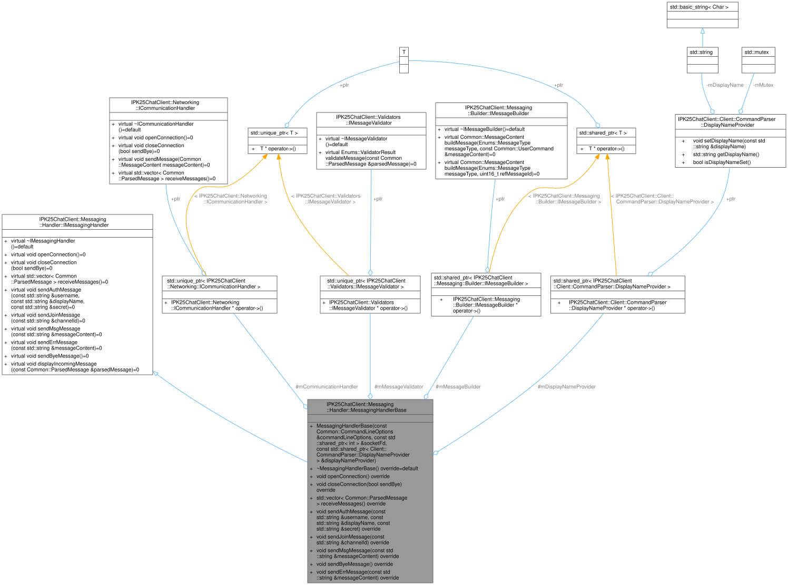

<span style="display: block; text-align: center;">*Obrázek 8: Bázová tříd `MessagingHandlerBase`*</span>

### 4.7 Modul `Networking`

Modul `Networking` zajišťuje veškerou síťovou komunikaci mezi klientem a serverem. Klíčovým aspektem implementace je nutnost 
odlišného přístupu k protokolům **TCP** a **UDP**. Jak jsem již zmiňoval na začátku dokumentace, zatímco **TCP** automaticky 
garantuje doručení a pořadí zpráv, **UDP** vyžaduje implementaci vlastních mechanismů spolehlivosti.

Pro **UDP** variantu bylo nutné vytvořit komplexní řešení zahrnující číslování zpráv, retransmise, potvrzování a detekci duplicit. 
Oproti tomu **TCP** varianta mohla využít vestavěné mechanismy protokolu.

Obě implementace sdílejí společné rozhraní `ICommunicationHandler` (podobně jako většina ostatních modulů a submodulů), které 
poskytuje jednotný přístup pro vyšší vrstvy aplikace. Díky této abstrakci jsou rozdíly mezi protokoly zcela zapouzdřeny 
v konkrétních implementacích a klient může pracovat s oběma variantami jednotným způsobem.

#### 4.7.1 Submodul `TCPCommunicationHandler`

Submodul `TcpCommunicationHandler` zajišťuje veškerou nízkoúrovňovou **TCP** komunikaci mezi klientem a serverem. Implementace 
využívá standardní funkce pro **TCP** komunikaci – `socket()`, `connect()` [[12]](https://man7.org/linux/man-pages/man2/connect.2.html), `send()` [[13]](https://man7.org/linux/man-pages/man2/send.2.html), `recv()` [[14]](https://man7.org/linux/man-pages/man2/recv.2.html), 
`shutdown()` [[15]](https://man7.org/linux/man-pages/man2/shutdown.2.html) a `close()`.  Efektivně zapouzdřuje komplexitu síťové komunikace.

Pro navázání spojení implementuje metoda `openConnection()` rezoluci doménových jmen pomocí `getaddrinfo()`. Po získání 
možných adres naváže spojení pomocí `connect()` [[12]](https://man7.org/linux/man-pages/man2/connect.2.html) s první dostupnou adresou. Získaný deskriptor socketu je uložen do
sdíleného ukazatele `mSocketFd`, který je dále využíván například u funkce `poll()` [[16]](https://moodle.vut.cz/pluginfile.php/1081875/mod_folder/content/0/IPK2024-25L-04-PROGRAMOVANI.pdf) ve _FSM_.

Odesílání zpráv řeší metoda `sendMessage()`. Příjem dat zajišťuje metoda `receiveMessages()`, která čte data ze socketu,
akumuluje je a následně analyzuje pomocí parseru. Implementace správně zvládá i fragmentované zprávy nebo situace, 
kdy v jednom paketu přijde více zpráv.

Ukončení spojení probíhá v metodě `closeConnection()` pomocí _"graceful termination"_, kdy je nejprve signalizováno 
dokončení odesílání dat a následně uzavřen socket (bez odeslání **TCP** `RST`).

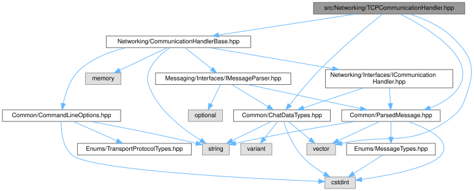

<span style="display: block; text-align: center;">*Obrázek 9: Třída `TCPCommunicationHandler`*</span>

#### 4.7.2 Submodul `UDPCommunicationHandler`

Submodul `UdpCommunicationHandler` musí řešit kritický problém nespolehlivé povahy **UDP** protokolu implementací 
vlastních mechanismů pro zajištění spolehlivého přenosu dat. Ačkoli je **UDP** bezstavový protokol, tak i zde má 
implementace vytváří socket a provádí rezoluci doménových jmen pomocí `getaddrinfo()` [[17]](https://man7.org/linux/man-pages/man3/getaddrinfo.3.html). Díky tomu může klient pracovat 
jak s doménovými jmény, tak s **IPv4** adresami v textovém formátu.

Stěžejním prvkem implementace je sofistikovaný systém retransmisí zpráv. Po odeslání každé zprávy pomocí `sendto()` [[18]](https://man7.org/linux/man-pages/man3/sendto.3p.html) metoda 
čeká na potvrzení této zprávy ze strany serveru pomocí zprávy `CONFIRM`. Pokud potvrzení není přijato v definovaném 
časovém limitu, zpráva je odeslána znovu, a tento proces se opakuje až do vyčerpání maximálního počtu pokusů. 
Příjem zpráv využívá neblokujícího volání funkcí `poll()` [[16]](https://moodle.vut.cz/pluginfile.php/1081875/mod_folder/content/0/IPK2024-25L-04-PROGRAMOVANI.pdf) a `recvfrom()` [[19]](https://man7.org/linux/man-pages/man3/recvfrom.3p.html). Současně je po příjmu zprávy kontrolováno, zda nedošlo
k dynemické změně portu – v tomto případě se výslovně **UDP** třídní člen `mServerAddr.sin_port` nastaví na nový dynamický port.
Zpracování dynamických portů serveru je velmi důležité při komunikaci přes NAT nebo proxy servery.

Deduplikaci zpráv zajišťuji pomocí dvojice metod `markAsSeen()` a `wasSeen()` a fronty ID již viděných zpráv `mSeenIds`.
Právě tyto dvě motody zajišťuje, že zprávy jsou zpracovány pouze jednou (viděné zprávy znovu nezpracovávám). Implementace této
**UDP** varianty také mechanismus buferování zpráv ve vektoru `mStagedMessages` během čekání na potvrzení, takže žádná 
legitimní zpráva není ztracena.

Některé typy zpráv jsou zpracovávány přímo v submodulu `UDPCommunicationHandler` a _FSM_ je jimi vůbec nezabývá. Například 
zpráva typu `PING` slouží čistě k ověření, že je klient stále aktivní a tedy bohatě při jejím obdržení stač přímo v rámci
submodulu `UDPCommunicationHandler` odeslat potvrzení o jejím obdržení. Zpráva `BYE` vyvolává speciální výjimku
`ServerSendByeException`, která je ale vyhozena až poté, co submodulu `UDPCommunicationHandler` přích zprávy `BYE` korektní
potvrdí serveru. Následně je vyhozena zmiňovaná výjimka, která je zachycena v rámci FSM a dochází k úspěšnému ukončení
běhu aplikace.

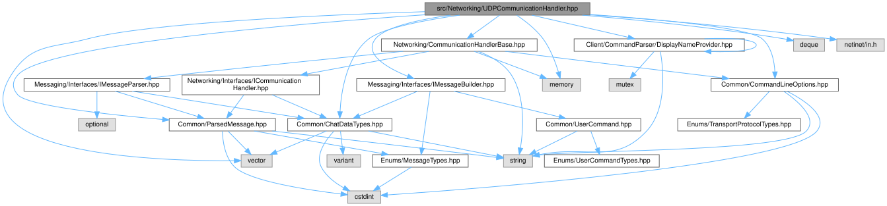

<span style="display: block; text-align: center;">*Obrázek 10: Třída `UDPCommunicationHandler`*</span>

### 4.8 Modul `App`

Nakonec je zde modul `App`, který obsahuje vstupní bod aplikace v podobě souboru `main.cpp`. Jeho
implementace je minimalistická – registruje signálové *handlery*, vytváří instanci třídy `MainClientFacade`. Dále  invokuje 
metodu `runChatClient(argc, argv)` čímž rozbíhá *kolesa* mého programu. Celý tento proces je zabalený do bloku `try-catch` – 
jde pouze *good-practice*, protože všechny výjimky by měly být zachyceny v rámci fasády (rád se ale držím hesla *"Better Sure Than Sorry."*).

---

## 5. Testování a verifikace funkčnosti

### 5.1 Interaktivní testovací konverzace mezi více instancemi klienta

Tato sekce dokumentuje výsledky testování aplikace z hlediska její interaktivní schopnosti chatování pomocí **TCP** a **UDP** protokolů.
Testování ověřovalo základní funkčnost mého chatovacího klienta, funkčnost všech příkazů a schopnost odesílat a přijímat 
zprávy. Následující testovací scenář postrádá pouze užití příkazu `/help`, jehož užití ale můžete v sekci [8.4](#84-ukázka-použití-příkazu-help-pro-zobrazení-nápovědy-v-průběhu-chatování).

Pro simluaci reaálného provozu mého testovacího klienta jsem použil oficiální virtuální stroj s nainstalovaným
vývojovým prostředím. Vývojové prostředí *IPK C* jsem spouštěl s administrátorským opravněním uživatele **ipk**.
Klient jako takový ovšem ke svému běhu superuživatelská práva nepotřebuje, takže jej lze spouštět i bez nich.

Pro efektivní testování komunikace mezi více klienty jsem vytvořil testovací skript `Server.py` (dostupný v adresáři `test/`),
který simuluje chování vzdáleného chatovacího serveru na lokálním rozhraní. V zájmu časové efektivity jsem při tvorbě tohoto
testovacího nástroje využil asistenci AI, konkrétně modelu *Claude 3.7 Sonnet Thinking* skrz rozšíření *GitHub Copilot*. Tento
skript sloužil výhradně pro testovací účely, a proto jej nepovažuji za součást vlastního řešení projektu a vzdávám se veškerých
autorských práv na tento skript a žádám, aby byl vyločen z kontroly plagiátorství a využití nástrojů **LLM** (pro jistotu ho přeci jen
nechám dostupný pouze skrz *Gitea* repozitář a nebudu ho odevzdávat jako součást archvu do systému *StudIS*). Zdůrazňuji, že
samotný chatovací klient, který je předmětem hodnocení, byl implementován zcela samostatně a případné využití generovaného či vypůjčeného
kódu je řádně uvedeno u dotyčných metod v příslušných hlavičkových souborech.

Mezi hlavní schopnosti lokálního testovacího serveru patří:
- podpora obou transportních protokolů a práce s příslušnou formou zpráv (textovou/binární),
- korektní odesílání `REPLY` zpráv při autentizaci nebo změně kanálu,
- zpracování všech příkazů (`AUTH`, `JOIN`, `REPLY`, `BYE`, ...)
- implementace potvrzovacího mechanismu `CONFIRM` zpráv pro UDP komunikaci,
  - odesílání `CONFIRM` zpráv po přijetí zprávy od **UDP** klienta,
  - kontrola, zda klient potvrdil příjem zprávy ze serveru `CONFIRM` zprávou s korektním `refMessageID`,
- možnost změny kanálů včetně upozornění o příchodech a odchodech uživatelů,
- automatické generování a odesílání zpráv `PING` pro testování dostupnosti klienta.

Díky těmto vlastnostem server věrně napodobuje chování referenčního Discord serveru (`anton5.fit.vutbr.cz`) a poskytuje ideální
prostředí pro testování chatovacího klienta v kontrolovaném prostředí bez nutnosti připojení k veřejnému serveru.

#### 5.1.1 Testovací prostředí

- **Operační systém**: Ubuntu 24.04.2 LTS, `amd64` ([IPK25_Ubuntu24.ova](https://nextcloud.fit.vutbr.cz/s/N5fM3Njwm6yfbeZ/download?path=%2F&files=IPK25_Ubuntu24.ova))
- **Vývojové prostředí**: `nix develop "git+https://git.fit.vutbr.cz/NESFIT/dev-envs.git?dir=ipk#c"` [[20]](https://git.fit.vutbr.cz/NESFIT/dev-envs)
- **Standard C++**: C++20
- **Překladač**: GCC 13.3.0
- **GNU Make**: verze 4.4.1
- **Knihovna `CLI11`**: verze 2.5.0

#### 5.1.2 Testovací scénář

Testovací scénář byl navržen tak, aby pokryl všechny základní funkce chatovacího klienta. Jde o konverzaci mezi třemi 
instancemi mého chatovacího klienta připojených k lokálnímu testoacímu serveru. Testovací scénář jsem navrhl jako rychlou
konverzaci mezi třemi kamarády – *Johnem*, *Evou* a *Mikem*.

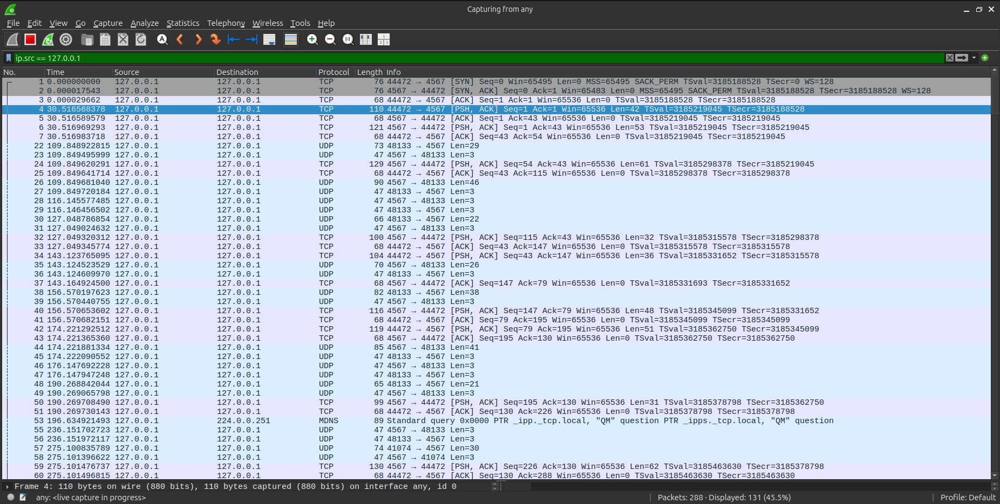

<span style="display: block; text-align: center;">*Obrázek 11: Ukázka úvodu interaktivní testovací konverzace v programu **Wireshark***</span>

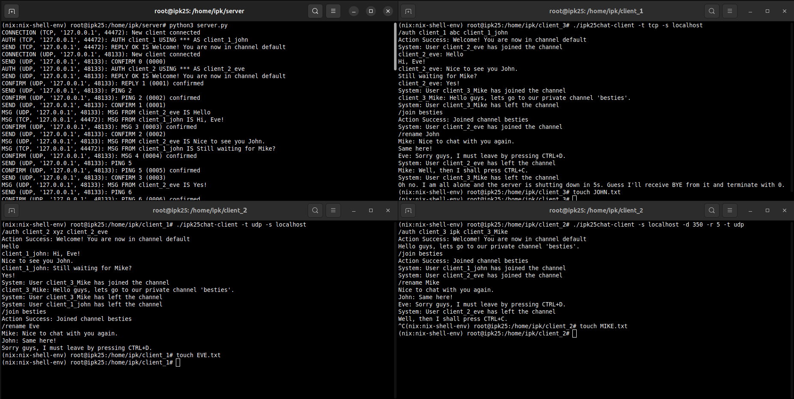

<span style="display: block; text-align: center;">*Obrázek 12: Ukázka průběhu interaktivní testovací konverzace na referenčním stroji*</span>

Jak je patrné ze *screenshotu* jejich komunikace, *John* s *Evou* se k serveru připojili jako první. *John* k připojení využil
transportní protokol **TCP**, zatímco *Eva* zvolila **UDP**. *Mike* se připojil jako poslední taktéž si zvolil **UDP** variantu, a to
s parametrizací počtu pokusů o znovuodeslání zpráv při ztrátě zprávy na 5 pokusů a dobu mezi retransmisemi na 350 ms.

*John* se jako první připojil k serveru a úspěšně se autentizoval pomocí příkazu `/auth`. Následně se připojil k kanálu 
`general`, kde začal chatovat s *Evou*, která se připojila a autentizovala chvilku po něm. *John* s *Evou* si spolu vyměnili
při čekání na *Mika* několik zpráv, přičemž si z výpisu konverzace můžete povšimnout, že klient správně zpracovává příchozí zprávy ze serveru
a zprávy se korektně zobrazují všem uživatelům v kanálu `general`. U **UDP** varianty je navíc, vidět, že klient správně pracuje jak s
příchozími, tak odchozími zprávami typu `CONFIRM` a v souladu se zadáním reaguje na příchozí zprávy typu `PING` odesláním potvrzení.

*Mike* se připojil k serveru jako poslední a úspěšně se autentizoval pomocí příkazu `/auth`. Následně se připojil k kanálu k *Johnovi* a 
*Evě* do kanálu `general`. *Mike* se pak přepojil pomocí příkazu `/join` do kanálu `besties`, kam se za ním obratem připojil i *John* s *Evou*.
Opět si můžete povšimnout, že v případě **UDP** klientů server nejdříve odešle potvrzení na příchozí požadavek o změně kanálu, následně odešle odpověď 
`REPLY` o tom, že se přepojení povedlo, a klient na odpověď serveru reaguje potvrzením `CONFIRM` naopak ze své strany. V případě **TCP** klienta
je to obdobné, ale server neodesílá potvrzení o přijetí zprávy, ale pouze odpověď `REPLY` na požadavek o změnu kanálu, na kterou klient v případě
protokolu **TCP** nijak nereaguje.

V další části konverzace si uživatelé upravili svá zobrazovaná jména příkazem `/rename`. Tato funkce umožňuje změnit jméno, pod kterým se zprávy zobrazují 
ostatním účastníkům. Díky tomu se zprávy od uživatelů v chatu nezobrazují pod jejich původními jmény (např. *client_3_mike*), ale pod změněnými jmény (např. *Mike*). 
Server po této změně automaticky používá nová zobrazovaná jména při distribuci zpráv ostatním připojeným klientům.

Bohužel, *Eva* musí rychle odejít ze skupinového chatu (zvolila si vypnutí klienta pomocí klávesové zkratky `CTRL+D`), což vyústí také v odchod *Mika* (stisknutím `CTRL+C`).
Nakonec zůstane připojený pouze *John*, kterému ale ze strany serveru přijde (například z důvodu plánované údržby) zpráva `BYE`, na což *Johnův* klient reaguje ukončením 
spojení a následně také ukončením aplikace s návratovým kódem `0`. Jak *Eva*, tak *Mike* svým odchodem ze serveru způsobili korektní odeslání zprávy `BYE` serveru, 
čímž ho informovali o svém odchodu, načež čekali na potvrzení přijetí těchto zpráv ze strany serveru, jelikož komunikovali pomocí protokolu **UDP**. Po přojetí potvrzení
ze strany serveru oba jejich klienti korektně ukončili spojení a následně také aplikaci s návratovým kódem `0`. Tím jejich komunikace skončila.

Věřím, že tento testovací scénář dostatečně pokrývá všechny základní funkce chatovacího klienta a demonstruje jeho schopnost interaktivně komunikovat jak pomocí
protokolu **TCP**, tak i pomocí protokolu **UDP**. Test dle mého názoru dopadl úspěšně a vše fungovalo dle mých očekávání. 

Níže přikládám textový záznam této konverzace. Zprávy a příkazy *Johna* jsou reprezentovaný <span style="color: turquoise;">tyrkysovou</span> barvou, *Evy* <span style="color: pink;">růžovou</span> 
barvou a *Mika* <span style="color: tomato;">červenou</span> barvou. Zprávy odeslané *serverem* jsou zobrazeny <span style="color: orange;">oranžovou</span> barvou:

**Chat z pohledu *Johna*:**
<pre>
<span style="font-weight: bold;">(nix:nix-shell-env) root@ipk25:/home/ipk/client_3# ./ipk25chat-client -t tcp -s localhost</span>
<span style="color: turquoise;">/auth client_1 abc client_1_john</span>
<span style="color: orange;">Action Success: Welcome! You are now in channel default</span>
<span style="color: orange;">System: User client_2_eve has joined the channel</span>
<span style="color: pink;">client_2_eve: Hello</span>
<span style="color: turquoise;">Hi, Eve!</span>
<span style="color: pink;">client_2_eve: Nice to see you John.</span>
<span style="color: turquoise;">Still waiting for Mike?</span>
<span style="color: pink;">client_2_eve: Yes!</span>
<span style="color: orange;">System: User client_3_Mike has joined the channel</span>
<span style="color: tomato;">client_3_Mike: Hello guys, lets go to our private channel 'besties'.</span>
<span style="color: orange;">System: User client_3_Mike has left the channel</span>
<span style="color: turquoise;">/join besties</span>
<span style="color: orange;">Action Success: Joined channel besties</span>
<span style="color: orange;">System: User client_2_eve has joined the channel</span>
<span style="color: turquoise;">/rename John</span>
<span style="color: tomato;">Mike: Nice to chat with you again.</span>
<span style="color: turquoise;">Same here!</span>
<span style="color: pink;">Eve: Sorry guys, I must leave by pressing CTRL+D.</span>
<span style="color: orange;">System: User client_2_eve has left the channel</span>
<span style="color: tomato;">Mike: Well, then I shall press CTRL+C.</span>
<span style="color: orange;">System: User client_3_Mike has left the channel</span>
<span style="color: turquoise;">Oh no. I am all alone and the server is shutting down in 5s. Guess I'll receive BYE from it and terminate with 0.</span>
</pre>

**Chat z pohledu *Evy*:**
<pre>
<span style="font-weight: bold;">(nix:nix-shell-env) root@ipk25:/home/ipk/client_2# ./ipk25chat-client -t udp -s localhost</span>
<span style="color: pink;">/auth client_2 xyz client_2_eve</span>
<span style="color: orange;">Action Success: Welcome! You are now in channel default</span>
<span style="color: pink;">Hello</span>
<span style="color: turquoise;">client_1_john: Hi, Eve!</span>
<span style="color: pink;">Nice to see you John.</span>
<span style="color: turquoise;">client_1_john: Still waiting for Mike?</span>
<span style="color: pink;">Yes!</span>
<span style="color: orange;">System: User client_3_Mike has joined the channel</span>
<span style="color: tomato;">client_3_Mike: Hello guys, lets go to our private channel 'besties'.</span>
<span style="color: orange;">System: User client_3_Mike has left the channel</span>
<span style="color: orange;">System: User client_1_john has left the channel</span>
<span style="color: pink;">/join besties</span>
<span style="color: orange;">Action Success: Joined channel besties</span>
<span style="color: pink;">/rename Eve</span>
<span style="color: tomato;">Mike: Nice to chat with you again.</span>
<span style="color: turquoise;">John: Same here!</span>
<span style="color: pink;">Sorry guys, I must leave by pressing CTRL+D.</span>
</pre>

**Chat z pohledu *Mika*:**
<pre>
<span style="font-weight: bold;">(nix:nix-shell-env) root@ipk25:/home/ipk/client_3# ./ipk25chat-client -s localhost -d 350 -r 5 -t udp</span>
<span style="color: tomato;">/auth client_3 ipk client_3_Mike</span>
<span style="color: orange;">Action Success: Welcome! You are now in channel default</span>
<span style="color: tomato;">Hello guys, lets go to our private channel 'besties'.</span> 
<span style="color: tomato;">/join besties</span>
<span style="color: orange;">Action Success: Joined channel besties</span>
<span style="color: orange;">System: User client_1_john has joined the channel</span>
<span style="color: orange;">System: User client_2_eve has joined the channel</span>
<span style="color: tomato;">/rename Mike</span>
<span style="color: tomato;">Nice to chat with you again.</span>
<span style="color: turquoise;">John: Same here!</span>
<span style="color: pink;">Eve: Sorry guys, I must leave by pressing CTRL+D.</span>
<span style="color: orange;">System: User client_2_eve has left the channel</span>
<span style="color: tomato;">Well, then I shall press CTRL+C.</span>
</pre>

**Chat z pohledu *Server*** *(rozesílání uživatelských zpráv není obsaženo)*:
<pre>
<span style="font-weight: bold;">(nix:nix-shell-env) root@ipk25:/home/ipk/server# python3 server.py</span>
<span style="color: orange;">CONNECTION (TCP, '127.0.0.1', 44472): New client connected</span>
<span style="color: turquoise;">AUTH (TCP, '127.0.0.1', 44472): AUTH client_1 USING *** AS client_1_john</span>
<span style="color: orange;">SEND (TCP, '127.0.0.1', 44472): REPLY OK IS Welcome! You are now in channel default</span>
<span style="color: pink;">CONNECTION (UDP, '127.0.0.1', 48133): New client connected</span>
<span style="color: pink;">AUTH (UDP, '127.0.0.1', 48133): AUTH client_2 USING *** AS client_2_eve</span>
<span style="color: orange;">SEND (UDP, '127.0.0.1', 48133): CONFIRM 0 (0000)</span>
<span style="color: orange;">SEND (UDP, '127.0.0.1', 48133): REPLY OK IS Welcome! You are now in channel default</span>
<span style="color: pink;">CONFIRM (UDP, '127.0.0.1', 48133): REPLY 1 (0001) confirmed</span>
<span style="color: orange;">SEND (UDP, '127.0.0.1', 48133): PING 2</span>
<span style="color: pink;">CONFIRM (UDP, '127.0.0.1', 48133): PING 2 (0002) confirmed</span>
<span style="color: pink;">MSG (UDP, '127.0.0.1', 48133): MSG FROM client_2_eve IS Hello</span>
<span style="color: orange;">SEND (UDP, '127.0.0.1', 48133): CONFIRM 1 (0001)</span>
<span style="color: turquoise;">MSG (TCP, '127.0.0.1', 44472): MSG FROM client_1_john IS Hi, Eve!</span>
<span style="color: pink;">CONFIRM (UDP, '127.0.0.1', 48133): MSG 3 (0003) confirmed</span>
<span style="color: pink;">MSG (UDP, '127.0.0.1', 48133): MSG FROM client_2_eve IS Nice to see you John.</span>
<span style="color: orange;">SEND (UDP, '127.0.0.1', 48133): CONFIRM 2 (0002)</span>
<span style="color: turquoise;">MSG (TCP, '127.0.0.1', 44472): MSG FROM client_1_john IS Still waiting for Mike?</span>
<span style="color: pink;">CONFIRM (UDP, '127.0.0.1', 48133): MSG 4 (0004) confirmed</span>
<span style="color: orange;">SEND (UDP, '127.0.0.1', 48133): PING 5</span>
<span style="color: pink;">CONFIRM (UDP, '127.0.0.1', 48133): PING 5 (0005) confirmed</span>
<span style="color: pink;">MSG (UDP, '127.0.0.1', 48133): MSG FROM client_2_eve IS Yes!</span>
<span style="color: orange;">SEND (UDP, '127.0.0.1', 48133): CONFIRM 3 (0003)</span>
<span style="color: orange;">SEND (UDP, '127.0.0.1', 48133): PING 6</span>
<span style="color: pink;">CONFIRM (UDP, '127.0.0.1', 48133): PING 6 (0006) confirmed</span>
<span style="color: tomato;">CONNECTION (UDP, '127.0.0.1', 41074): New client connected</span>
<span style="color: tomato;">AUTH (UDP, '127.0.0.1', 41074): AUTH client_3 USING *** AS client_3_Mike</span>
<span style="color: orange;">SEND (UDP, '127.0.0.1', 41074): CONFIRM 0 (0000)</span>
<span style="color: orange;">SEND (UDP, '127.0.0.1', 41074): REPLY OK IS Welcome! You are now in channel default</span>
<span style="color: tomato;">CONFIRM (UDP, '127.0.0.1', 41074): REPLY 8 (0008) confirmed</span>
<span style="color: pink;">CONFIRM (UDP, '127.0.0.1', 48133): MSG 7 (0007) confirmed</span>
<span style="color: orange;">SEND (UDP, '127.0.0.1', 48133): PING 9</span>
<span style="color: orange;">SEND (UDP, '127.0.0.1', 41074): PING 10</span>
<span style="color: pink;">CONFIRM (UDP, '127.0.0.1', 48133): PING 9 (0009) confirmed</span>
<span style="color: tomato;">CONFIRM (UDP, '127.0.0.1', 41074): PING 10 (000A) confirmed</span>
<span style="color: tomato;">MSG (UDP, '127.0.0.1', 41074): MSG FROM client_3_Mike IS Hello guys, lets go to our private channel 'besties'.</span>
<span style="color: orange;">SEND (UDP, '127.0.0.1', 41074): CONFIRM 1 (0001)</span>
<span style="color: tomato;">CONFIRM (UDP, '127.0.0.1', 48133): MSG 11 (000B) confirmed</span>
<span style="color: tomato;">JOIN (UDP, '127.0.0.1', 41074): JOIN besties AS client_3_Mike</span>
<span style="color: orange;">SEND (UDP, '127.0.0.1', 41074): CONFIRM 2 (0002)</span>
<span style="color: orange;">SEND (UDP, '127.0.0.1', 41074): REPLY OK IS Joined channel besties</span>
<span style="color: tomato;">CONFIRM (UDP, '127.0.0.1', 41074): REPLY 13 (000D) confirmed</span>
<span style="color: turquoise;">JOIN (TCP, '127.0.0.1', 44472): JOIN besties AS client_1_john</span>
<span style="color: pink;">CONFIRM (UDP, '127.0.0.1', 48133): MSG 12 (000C) confirmed</span>
<span style="color: orange;">SEND (TCP, '127.0.0.1', 44472): REPLY OK IS Joined channel besties</span>
<span style="color: pink;">CONFIRM (UDP, '127.0.0.1', 48133): MSG 14 (000E) confirmed</span>
<span style="color: tomato;">CONFIRM (UDP, '127.0.0.1', 41074): MSG 15 (000F) confirmed</span>
<span style="color: orange;">SEND (UDP, '127.0.0.1', 48133): PING 16</span>
<span style="color: orange;">SEND (UDP, '127.0.0.1', 41074): PING 17</span>
<span style="color: pink;">CONFIRM (UDP, '127.0.0.1', 48133): PING 16 (0010) confirmed</span>
<span style="color: tomato;">CONFIRM (UDP, '127.0.0.1', 41074): PING 17 (0011) confirmed</span>
<span style="color: pink;">JOIN (UDP, '127.0.0.1', 48133): JOIN besties AS client_2_eve</span>
<span style="color: orange;">SEND (UDP, '127.0.0.1', 48133): CONFIRM 4 (0004)</span>
<span style="color: orange;">SEND (UDP, '127.0.0.1', 48133): REPLY OK IS Joined channel besties</span>
<span style="color: pink;">CONFIRM (UDP, '127.0.0.1', 48133): REPLY 18 (0012) confirmed</span>
<span style="color: tomato;">CONFIRM (UDP, '127.0.0.1', 41074): MSG 19 (0013) confirmed</span>
<span style="color: tomato;">MSG (UDP, '127.0.0.1', 41074): MSG FROM Mike IS Nice to chat with you again.</span>
<span style="color: orange;">SEND (UDP, '127.0.0.1', 41074): CONFIRM 3 (0003)</span>
<span style="color: pink;">CONFIRM (UDP, '127.0.0.1', 48133): MSG 20 (0014) confirmed</span>
<span style="color: orange;">SEND (UDP, '127.0.0.1', 48133): PING 21</span>
<span style="color: orange;">SEND (UDP, '127.0.0.1', 41074): PING 22</span>
<span style="color: pink;">CONFIRM (UDP, '127.0.0.1', 48133): PING 21 (0015) confirmed</span>
<span style="color: tomato;">CONFIRM (UDP, '127.0.0.1', 41074): PING 22 (0016) confirmed</span>
<span style="color: turquoise;">MSG (TCP, '127.0.0.1', 44472): MSG FROM John IS Same here!</span>
<span style="color: pink;">CONFIRM (UDP, '127.0.0.1', 48133): MSG 23 (0017) confirmed</span>
<span style="color: tomato;">CONFIRM (UDP, '127.0.0.1', 41074): MSG 24 (0018) confirmed</span>
<span style="color: pink;">MSG (UDP, '127.0.0.1', 48133): MSG FROM Eve IS Sorry guys, I must leave by pressing CTRL+D.</span>
<span style="color: orange;">SEND (UDP, '127.0.0.1', 48133): CONFIRM 5 (0005)</span>
<span style="color: tomato;">CONFIRM (UDP, '127.0.0.1', 41074): MSG 25 (0019) confirmed</span>
<span style="color: pink;">BYE (UDP, '127.0.0.1', 48133): BYE FROM Eve</span>
<span style="color: orange;">SEND (UDP, '127.0.0.1', 48133): CONFIRM 6 (0006)</span>
<span style="color: tomato;">CONFIRM (UDP, '127.0.0.1', 41074): MSG 26 (001A) confirmed</span>
<span style="color: orange;">SEND (UDP, '127.0.0.1', 41074): PING 27</span>
<span style="color: tomato;">CONFIRM (UDP, '127.0.0.1', 41074): PING 27 (001B) confirmed</span>
<span style="color: tomato;">MSG (UDP, '127.0.0.1', 41074): MSG FROM Mike IS Well, then I shall press CTRL+C.</span>
<span style="color: orange;">SEND (UDP, '127.0.0.1', 41074): CONFIRM 4 (0004)</span>
<span style="color: tomato;">BYE (UDP, '127.0.0.1', 41074): BYE FROM Mike</span>
<span style="color: orange;">SEND (UDP, '127.0.0.1', 41074): CONFIRM 5 (0005)</span>
<span style="color: turquoise;">MSG (TCP, '127.0.0.1', 44472): MSG FROM John IS Oh no. I am all alone and the server 
is shutting down in 5s. Guess I'll receive BYE from it and terminate with 0.</span>
<span style="font-weight: bold;">^CSignal 2 received, exiting...</span>
<span style="font-weight: bold;">Stopping server...</span>
<span style="color: orange;">SEND (TCP, '127.0.0.1', 44472): BYE FROM Server</span>
</pre>

Celou konverzaci jsem také zaznamenával pomocí programu Wireshark, ze kterého přikládám několik screenshotů demonstrující správný chod aplikace. 
Záznam této konverzace je dostupný také v adresáři `test/` pod názvem `test_communication_capture.pcapng.gzip`.

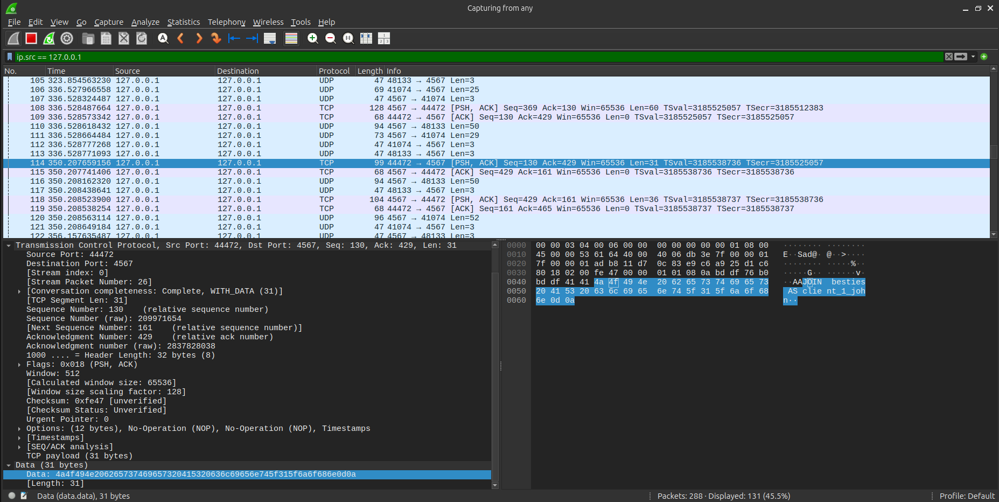

<span style="display: block; text-align: center;">*Obrázek 13: Ukázka **TCP** zprávy `JOIN` zaslané klientem v programu **Wireshark***</span>

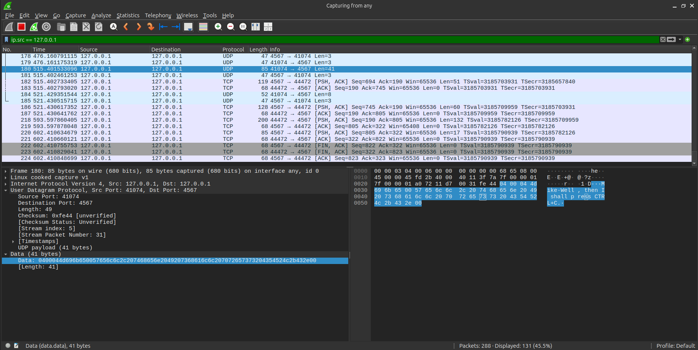

<span style="display: block; text-align: center;">*Obrázek 14: Ukázka **UDP** zprávy `MSG` zaslané klientem v programu **Wireshark***</span>

### 5.2 Testování pomocí testů od *Vlad6422*

#### 5.2.1 Testovací prostředí

- **Operační systém**: Windows 11 WSL Ubuntu 24.04.2 LTS
- **Standard C++**: C++20
- **Překladač**: GCC 14.2.0
- **Knihovna `CLI11`**: verze 2.5.0

#### 5.2.2 Testovací scénář

V rámci testování jsem použil také testy od *Vlad6422*, které jsou volně dostupné na portálu *GitHub* [[21]](https://github.com/Vlad6422/VUT_IPK_CLIENT_TESTS/tree/main).
Testy jsem si mimo jiné doplnil i o své vlastní testy – např. testy pro korektní detekci příliš dlouhé `messageContent` 
anebo její přřetečení a tedy nutnost ořezání, ... 

Tyto testy byly velmi užitečné zejména ve fázi ladění a optimalizace
protože díky nim šlo nasimulovat krátké testovací scénáře s možností přesně zadat očekávaný vstup i výstup klienta, nebo
kontrolovat očekávané odchozí a příchozí zprávy včetně jejich obsahu a `messageID`.

Tímto bych tedy chtěl _Tomáši Hobzovi_ alias *Vlad6422* velmi poděkovat za jeho krásné testy, které mi velmi pomohly 
při testování mé aplikace.

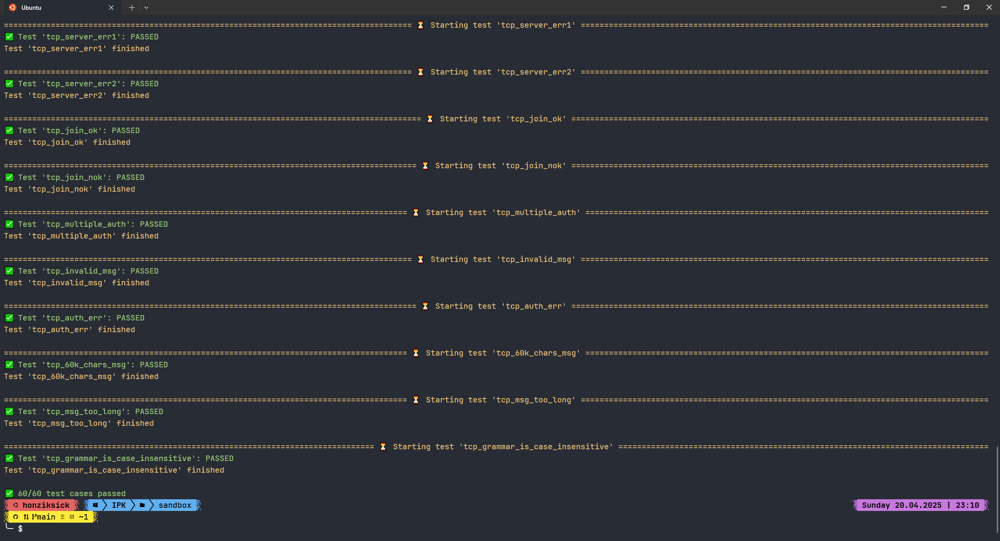

<span style="display: block; text-align: center;">*Obrázek 15: Výsledek testů od **Tomáše Hobzi** alias `Vlad6422`*</span>

---

## 6. Závěr

V tomto projektu jsem implementoval chatovacího klienta podle specifikace protokolu **IPK25-CHAT** s podporou pro dvě
varianty transportního protokolu, **TCP** a **UDP**. Nejvýznamnější výzvou bylo vytvoření vlastního mechanismu spolehlivého 
přenosu pro **UDP** variantu, zahrnujícího číslování zpráv, retransmise, detekci duplicit a správu dynamických portů.

Podařilo se mi vytvořit modulární architekturu s jasnými rozhraními, která efektivně odděluje jednotlivé vrstvy aplikace 
a zapouzdřuje odlišnosti mezi protokoly. Díky tomu vyšší vrstvy aplikace pracují s oběma variantami transportních protokolů 
jednotným způsobem.

Během vývoje jsem se naučil mnoho o síťové komunikaci na nižší úrovni, zejména o praktických rozdílech mezi spojovanou a 
nespojovanou komunikací a o implementaci spolehlivého přenosu dat nad nespolehlivým protokolem. Přestože projekt obsahuje 
několik oblastí, které by zasloužily další refaktoring, považuji výslednou implementaci za robustní a dobře strukturovanou.
Věřím, že mi získané zkušenosti s objektově orientovaným návrhem a implementací pomohou v budoucích projektech.

---

## 7. Bibliografie

[1] <span class="smallcaps">**Dolejška, D.**</span> *Projekt 2 – IPK25 Chat* [online]. VUT FIT Brno, únor 2025. Dostupné z: https://git.fit.vutbr.cz/NESFIT/IPK-Projects/src/branch/master/Project_2. [cit. 2025-04-20]. <br>
[2] <span class="smallcaps">**Koziero, Ch. M.**</span> *TCP Operational Overview and the TCP Finite State Machine (FSM)* [online]. TCPIPGuide, září 2005. Dostupné z: http://tcpipguide.com/free/t_TCPOperationalOverviewandtheTCPFiniteStateMachineF-2.htm. [cit. 2025-04-20]. <br>
[3] <span class="smallcaps">**Postel, J**</span> *RFC 768 – User Datagram Protocol* [online]. IETF, srpen 1980. Dostupné z: https://datatracker.ietf.org/doc/html/rfc768. [cit. 2025-04-20]. <br>
[4] <span class="smallcaps">**Eggert, L., Fairhurst, G.**</span> *RFC 5405 – Unicast UDP Usage Guidelines for Application Designers* [online]. IETF, listopad 2008. Dostupné z: https://datatracker.ietf.org/doc/html/rfc5405. [cit. 2025-04-20]. <br>
[5] <span class="smallcaps">**Information Sciences Institute, University of Southern California**</span> *RFC 793 – Transmission Control Protocol* [online]. IETF, září 1981. Dostupné z: https://tools.ietf.org/html/rfc793. [cit. 2025-04-20]. <br>
[6] <span class="smallcaps">**Duke, M., Braden, B., Eddy, W., Blanton, E., Zimmermann, A.**</span> *RFC 7414 – A Roadmap for Transmission Control Protocol (TCP)* [online]. IETF, únor 2015. Dostupné z: https://datatracker.ietf.org/doc/html/rfc7414. [cit. 2025-04-20]. <br>
[7] <span class="smallcaps">**Křivka, Z.**</span> *Principy objektově-orientovaného programování* [online]. VUT FIT Brno, březen 2025. Dostupné z: https://moodle.vut.cz/pluginfile.php/1064523/mod_folder/content/0/03-05-IPP_OOJ-Krivka-2025.pdf. [cit. 2025-04-20]. <br>
[8] <span class="smallcaps">**Dybal, M.**</span> *SOLIDní kód: Psaní čistého a udržovatelného kódu* [online]. nesfit/ICS, březen 2019. Dostupné z: https://github.com/nesfit/ICS/blob/master/Lectures/Lecture_05/SOLIDni_kod.pdf. [cit. 2025-04-20]. <br>
[9] <span class="smallcaps">**The GeeksForGeeks Community**</span> *Single Responsibility in SOLID Design Principle* [online]. GeeksForGeeks, říjen 2023. Dostupné z: https://www.geeksforgeeks.org/single-responsibility-in-solid-design-principle/. [cit. 2025-04-20]. <br>
[10] <span class="smallcaps">**Schreiner, H.**</span> *CLI11: An introduction* [online]. GitBook, leden 2025. Dostupné z: https://cliutils.github.io/CLI11/book/. [cit. 2025-04-20]. <br>
[11] <span class="smallcaps">**The Wikipedia Community**</span> *Facade pattern* [online]. Wikipedia, leden 2025. Dostupné z: https://en.wikipedia.org/wiki/Facade_pattern. [cit. 2025-04-20]. <br>
[12] <span class="smallcaps">**Kerrisk M.**</span> *connect(2) — Linux manual page* [online]. Linux man-pages project, červenec 2024. Dostupné z: https://man7.org/linux/man-pages/man2/connect.2.html. [cit. 2025-04-20]. <br>
[13] <span class="smallcaps">**Kerrisk M.**</span> *send(2) — Linux manual page* [online]. Linux man-pages project, listopad 2024. Dostupné z: https://man7.org/linux/man-pages/man2/send.2.html. [cit. 2025-04-20]. <br>
[14] <span class="smallcaps">**Kerrisk M.**</span> *recv(2) — Linux manual page* [online]. Linux man-pages project, listopad 2024. Dostupné z: https://man7.org/linux/man-pages/man2/recv.2.html. [cit. 2025-04-20]. <br>
[15] <span class="smallcaps">**Kerrisk M.**</span> *shutdown(2) — Linux manual page* [online]. Linux man-pages project, červenec 2024. Dostupné z: https://man7.org/linux/man-pages/man2/shutdown.2.html. [cit. 2025-04-20]. <br>
[16] <span class="smallcaps">**Dolejška, D.**</span> *Programování síťových aplikací: poll()* [online]. VUT FIT Brno, březen 2024. Dostupné z: https://moodle.vut.cz/pluginfile.php/1081875/mod_folder/content/0/IPK2024-25L-04-PROGRAMOVANI.pdf. [cit. 2025-04-20]. <br>
[17] <span class="smallcaps">**Kerrisk M.**</span> *getaddrinfo(3) — Linux manual page* [online]. Linux man-pages project, listopad 2024. Dostupné z: https://man7.org/linux/man-pages/man3/getaddrinfo.3.html. [cit. 2025-04-20]. <br>
[18] <span class="smallcaps">**Kerrisk M.**</span> *sendto(3p) — Linux manual page* [online]. Linux man-pages project, 2017. Dostupné z: https://man7.org/linux/man-pages/man3/sendto.3p.html. [cit. 2025-04-20]. <br>
[19] <span class="smallcaps">**Kerrisk M.**</span> *recvfrom(3p) — Linux manual page* [online]. Linux man-pages project, 2017. Dostupné z: https://man7.org/linux/man-pages/man3/recvfrom.3p.html. [cit. 2025-04-20]. <br>
[20] <span class="smallcaps">**VUT FIT NESFIT tým**</span> *Shared Development Environments* [online]. VUT FIT Brno, březen 2025. Dostupné z: https://git.fit.vutbr.cz/NESFIT/dev-envs. [cit. 2025-04-22]. <br>
[21] <span class="smallcaps">**Hobza, T., Malashchuk , V.**</span> *VUT_IPK_CLIENT_TESTS* [online]. GitHub, duben 2025. Dostupné z: https://github.com/Vlad6422/VUT_IPK_CLIENT_TESTS/tree/main. [cit. 2025-04-22]. <br>

---

## 8. Přílohy

### 8.1 Adresářový strom projektu

<pre>
&thinsp;📁
 ├── 📄&thinsp;CHANGELOG.md
 ├── 📄&thinsp;CMakeLists.txt
 ├── 📄&thinsp;Doxyfile
 ├── 📄&thinsp;LICENSE
 ├── 📄&thinsp;Makefile
 ├── 📄&thinsp;README.md
 ├── 📁&thinsp;<b>doc</b>
 │   &thinsp;└──&thinsp;📁&thinsp;<b>resources</b>
 │         └── ...
 ├── 📁&thinsp;<b>src</b>
 │   &thinsp;├── 📁&thinsp;<b>App</b>
 │    └── 📄&thinsp;main.cpp
 ├── 📁&thinsp;<b>Arguments</b>
 │    ├── 📄&thinsp;ArgumentParser.[cpp|hpp]
 │    └── 📄&thinsp;CLI11.hpp
 ├── 📁&thinsp;<b>Client</b>
 │    ├── 📁&thinsp;<b>ClientFSM</b>
 │    │    ├── 📄&thinsp;ClientFSMBase.[cpp|hpp]
 │    │    ├── 📄&thinsp;TCPClientFSM.[cpp|hpp]
 │    │    └── 📄&thinsp;UDPClientFSM.[cpp|hpp]
 │    ├── 📁&thinsp;<b>ClientOutput</b>
 │    │    ├── 📄&thinsp;ClientOutput.[cpp|hpp]
 │    ├── 📁&thinsp;<b>CommandParser</b>
 │    │    ├── 📄&thinsp;DisplayNameProvider.[cpp|hpp]
 │    │    └── 📄&thinsp;UserCommandParser.[cpp|hpp]
 │    └── 📁&thinsp;<b>Interfaces</b>
 │         ├── 📄&thinsp;IClientFSM.hpp
 │         └── 📄&thinsp;IUserCommandParser.hpp
 ├── 📁&thinsp;<b>Common</b>
 │    ├── 📄&thinsp;ChatDataTypes.hpp
 │    ├── 📄&thinsp;CommandLineOptions.[cpp|hpp]
 │    ├── 📄&thinsp;ParsedMessage.[cpp|hpp]
 │    └── 📄&thinsp;UserCommand.hpp
 ├── 📁&thinsp;<b>Constants</b>
 │    ├── 📄&thinsp;ClientInternalErrorPhrases.hpp
 │    ├── 📄&thinsp;ClientLimits.hpp
 │    ├── 📄&thinsp;ColorEscapeSequences.hpp
 │    ├── 📄&thinsp;DefaultCommandLineOptions.hpp
 │    ├── 📄&thinsp;ExceptionMessages.hpp
 │    ├── 📄&thinsp;MessageFields.hpp
 │    ├── 📄&thinsp;MessageKeywords.hpp
 │    ├── 📄&thinsp;RandomNumbersRanges.hpp
 │    └── 📄&thinsp;RegexPatterns.hpp
 ├── 📁&thinsp;<b>Enums</b>
 │    ├── 📄&thinsp;ClientFSMStates.hpp
 │    ├── 📄&thinsp;ClientInternalErrorMessages.hpp
 │    ├── 📄&thinsp;ExitCodes.hpp
 │    ├── 📁&thinsp;<b>Mapping</b>
 │    │    ├── 📄&thinsp;EnumMappers.hpp
 │    │    └── 📄&thinsp;EnumMaps.[cpp|hpp]
 │    ├── 📄&thinsp;MessageParameters.hpp
 │    ├── 📄&thinsp;MessageTypes.hpp
 │    ├── 📄&thinsp;TransportProtocolTypes.hpp
 │    ├── 📄&thinsp;UserCommandTypes.hpp
 │    └── 📄&thinsp;ValidatorResults.hpp
 ├── 📁&thinsp;<b>Exceptions</b>
 │    ├── 📄&thinsp;ChatBaseException.[cpp|hpp]
 │    └── 📄&thinsp;ChatExceptions.[cpp|hpp]
 ├── 📁&thinsp;<b>Facades</b>
 │    └── 📄&thinsp;MainClientFacade.[cpp|hpp]
 ├── 📁&thinsp;<b>Messaging</b>
 │    ├── 📁&thinsp;<b>Interfaces</b>
 │    │    ├── 📄&thinsp;IMessageBuilder.hpp
 │    │    ├── 📄&thinsp;IMessageIDProvider.hpp
 │    │    ├── 📄&thinsp;IMessageParser.hpp
 │    │    └── 📄&thinsp;IMessagingHandler.hpp
 │    ├── 📁&thinsp;<b>MessageBuilder</b>
 │    │    ├── 📄&thinsp;MessageBuilderBase.[cpp|hpp]
 │    │    ├── 📄&thinsp;MessageIDProvider.[cpp|hpp]
 │    │    ├── 📄&thinsp;TCPMessageBuilder.[cpp|hpp]
 │    │    └── 📄&thinsp;UDPMessageBuilder.[cpp|hpp]
 │    ├── 📁&thinsp;<b>MessageParser</b>
 │    │    ├── 📄&thinsp;MessageParserBase.hpp
 │    │    ├── 📄&thinsp;TCPMessageParser.[cpp|hpp]
 │    │    └── 📄&thinsp;UDPMessageParser.[cpp|hpp]
 │    └── 📁&thinsp;<b>MessagingHandler</b>
 │         ├── 📄&thinsp;MessagingHandlerBase.[cpp|hpp]
 │         ├── 📄&thinsp;TCPMessagingHandler.[cpp|hpp]
 │         └── 📄&thinsp;UDPMessagingHandler.[cpp|hpp]
 ├── 📁&thinsp;<b>Networking</b>
 │    ├── 📄&thinsp;CommunicationHandlerBase.[cpp|hpp]
 │    ├── 📁&thinsp;<b>Interfaces</b>
 │    │    └── 📄&thinsp;ICommunicationHandler.hpp
 │    ├── 📄&thinsp;TCPCommunicationHandler.[cpp|hpp]
 │    └── 📄&thinsp;UDPCommunicationHandler.[cpp|hpp]
 ├── 📁&thinsp;<b>Utilities</b>
 │    ├── 📄&thinsp;CastUtils.hpp
 │    ├── 📄&thinsp;CommunicationUtils.[cpp|hpp]
 │    ├── 📄&thinsp;ExceptionHandler.[cpp|hpp]
 │    ├── 📄&thinsp;Logger.hpp
 │    ├── 📄&thinsp;RandomNumberGenerator.[cpp|hpp]
 │    ├── 📄&thinsp;SignalHandler.[cpp|hpp]
 │    └── 📄&thinsp;StringUtils.[cpp|hpp]
 └── 📁&thinsp;<b>Validators</b>
      ├── 📁&thinsp;<b>Interfaces</b>
      │    ├── 📄&thinsp;IMessageParametersValidator.hpp
      │    ├── 📄&thinsp;IMessageValidator.hpp
      │    └── 📄&thinsp;IValidator.hpp
      ├── 📄&thinsp;MessageParametersValidator.[cpp|hpp]
      ├── 📄&thinsp;MessageValidatorBase.[cpp|hpp]
      ├── 📄&thinsp;TCPMessageValidator.[cpp|hpp]
      └── 📄&thinsp;UDPMessageValidator.[cpp|hpp]
</pre>

### 8.2 Výstup příkazu `make help`

```bash
make help
```

<pre>
<span style="color: #ffcc00;">Main Commands:</span>
<span style="color: #00cccc;">all                           </span> Builds the 'ipk25chat-client'
<span style="color: #00cccc;">build                         </span> Builds the 'ipk25chat-client' via CMake in developer version and Make in submission version
<span style="color: #00cccc;">clean                         </span> Runs 'clean-all' in developer / submission mode (different versions)
<span style="color: #00cccc;">doc                           </span> Generates project documentation into the `doc` directory (different versions)
<span style="color: #00cccc;">help                          </span> Prints help for using the Makefile
<span style="color: #00cccc;">pack                          </span> Creates a ZIP archive with files intended for submission (not allowed for submission)

<span style="color: #ffcc00;">Clean (special):</span>
<span style="color: #00cccc;">clean-all                     </span> Removes all created files (build, doc, executable, archive, ...)
<span style="color: #00cccc;">clean-build                   </span> Removes the 'build' directory
<span style="color: #00cccc;">clean-doc                     </span> Removes generated content of the 'doc' directory
<span style="color: #00cccc;">clean-exec                    </span> Removes the executable
<span style="color: #00cccc;">clean-pack                    </span> Removes the 'pack' directory including the archive (not allowed for submission)

<span style="color: #ffcc00;">Pack (special):</span>
<span style="color: #00cccc;">pack-prepare                  </span> Copies all necessary files to the 'pack/xkalinj00' directory (not allowed for submission)

<span style="color: #ffcc00;">Install Dependencies:</span>
<span style="color: #00cccc;">developer-mode                </span> Switches the Makefile to developer mode
<span style="color: #00cccc;">install-dev-dep               </span> Installs dependencies needed for using all 'Makefile' functions (not allowed for submission)
<span style="color: #00cccc;">install-doc-dep               </span> Installs dependencies needed for generating documentation - 'doxygen' (not allowed for submission)
<span style="color: #00cccc;">install-help-dep              </span> Installs dependencies needed for printing 'Makefile' help - 'less' (not allowed for submission)
<span style="color: #00cccc;">install-pack-dep              </span> Installs dependencies needed for project packaging - 'rsync', 'zip' (not allowed for submission)
<span style="color: #00cccc;">submission-mode               </span> Switches the Makefile to submission mode
<span style="color: #00cccc;">update-dep                    </span> Updates the list of available packages (not allowed for submission)
</pre>

### 8.3 Ukázka spuštění programu s parametrem `-h` pro výpis nápovědy

```bash
./ipk25chat-client -h
```

```terminaloutput
IPK25 Chat Client v1.0

DESCRIPTION:
IPK25 Chat Client implements the IPK25-CHAT protocol over TCP or UDP (IPv4
 only). Supports user authentication, channel management, message exchange and
 graceful termination. UDP variant includes application‑level CONFIRM and
 retransmission logic; TCP variant uses a simple text grammar over a reliable
 stream.


 USAGE:
   ./ipk25chat-client [-t udpOrTcp | --transport-protocol udpOrTcp] [-s ipOrHostname | --server ipOrHostname]
                      <-p port | --port port> <-d timeout | --wait timeout> <-r max | --max-retransmissions max>


OPTIONS:
  -h,     --help              Display this help message and terminate the program with exit
                               code 0
  -t,     --transport-protocol
                              Transport protocol to use: "tcp" or "udp"
  -s,     --server            Hostname or IPv4 address of the chat server
  -p,     --port              Server port (default: 4567)
  -r,     --max-retransmissions
                              UDP confirmation timeout in milliseconds (default: 250)
  -d,     --wait              Maximum number of UDP retransmissions (default: 3)


EXAMPLE USAGE:
   ./ipk25chat-client -t tcp -s 127.0.0.1
   ./ipk25chat-client -t tcp -s localhost
   ./ipk25chat-client -t udp -s chat.example.com -p 10000
   ./ipk25chat-client -t udp -s 192.168.1.5 -p 3000 -d 100 -r 1


EXIT CODES:
    0 – Success
   64 – Invalid argument (usage error)
   68 – Hostname resolution error
   70 – Internal error
   71 – Connection (socket) error
   76 – Protocol error
   78 – Unknown error
  107 – Connection unexpectedly not established
  110 – Message lost (retransmission limit exceeded)
  116 – Connection timed out
```

### 8.4 Ukázka použití příkazu `/help` pro zobrazení nápovědy v průběhu chatování

<span style="color: pink;">Růžově</span> zbarvené zprávy byly zadány uživatelem, zatímco <span style="color: turquoise;">
tyrkysově</span> zbarvené zprávy byly vypsány chatovacím klientem.

```bash
printf "Sending message without an authentication.\n/dontKnowWhatToDo\n/help\n" | ./ipk25chat-client -s anton5.fit.vutbr.cz -t tcp
```
<pre>
<span style="color: pink;">Sending message without an authentication.</span>
<span style="color: turquoise;">ERROR: Messages cannot be sent prior to authentication or without joining a chat
channel.</span>
<span style="color: pink;">/dontKnowWhatToDo</span>
<span style="color: turquoise;">ERROR: Oops, it appears you've entered an invalid command. You may use the '/help' 
command to view all valid client commands along with their description, structure
and usage examples.</span>
<span style="color: pink;">/help</span>
<span style="color: turquoise;">Usage:
/auth &lt;username&gt; &lt;secret&gt; &lt;displayName&gt;
    Authenticate with the chat server using your account name, password (secret)
    and the display name you wish to use.

/join &lt;channelId&gt;
    Join or switch to the specified channel. If you omit this, you stay in the 
    default channel assigned after AUTH.

/rename &lt;newDisplayName&gt;
    Change your display name for subsequent messages.

/help
    Show this help message.

/bye
    Exit the chat client gracefully (sends BYE to server and closes connection).

Chatting:
    To send a message to the current channel, just type your text without a leading 
    slash and press Enter. Messages longer than the protocol‐allowed maximum will be 
    truncated, and you will see a local warning. Maximum length of a message is 60000 
    characters and only these characters are allowed: Printable characters with space 
    and new line (enter).

Parameter Limits:
    - &lt;username&gt;: Max. length 20, allowed characters: [a-zA-Z0-9_-] (e.g., Abc_00-7)
    - &lt;channelId&gt;: Max. length 20, allowed characters: [a-zA-Z0-9_-] (e.g., Abc_00-7)
    - &lt;secret&gt;: Max. length 128, allowed characters: [a-zA-Z0-9_-] (e.g., Abc_00-7)
    - &lt;displayName&gt;: Max. length 20, allowed characters: Printable characters (0x21-7E)
    - MessageContent: Max. length 60000, allowed characters: Printable characters with  
                      space and line feed (0x0A, 0x20-7E)

Examples:
    /help
    /auth myNameIsJohn password John_TheIPKMaster00
    /join general
    /rename let-the-points-rain
    Hello world!</span>
</pre>
